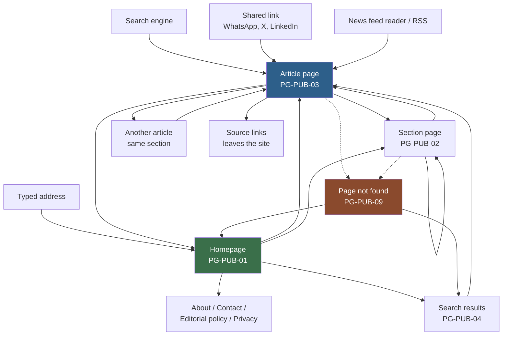

# 08 — Reader Flow

**Stage:** Phase 2 — product mapping
**Last updated:** 2026-09-08
**Covers:** every way a member of the public can arrive at the site and move through it

Labels are as defined in `07-product-map.md`:
**[CONFIRMED] / [PROVISIONAL] / [FUTURE] / [NEW ISSUE]**

---

## 0. The one thing to understand about news readers

**Most readers never see the homepage.**

They arrive on a single article from a search engine or a shared link, read it,
and leave. This is normal for news and it drives three consequences that shape
every flow in this document:

1. **The article page is the front door**, not the homepage. It must stand alone
   and make sense to someone who has never heard of the publication.
2. **Every article page must answer "what is this site?"** — masthead, section,
   date, author — because the reader has no context.
3. **The best moment to offer a second story is on the article page**, not the
   homepage. If we do not, the reader leaves.

---

## 1. Reader navigation map

Solid lines are normal navigation. Dotted lines are what happens when an address
is wrong, or a story has been withdrawn.

---

## 2. Journeys by entry point

Each journey uses the same structure:
**Where they start → What they see → What they can click → Where they go next → What data is shown.**

---

### R-01 — Arriving at the homepage

**Starts:** types the site address, or clicks the masthead from anywhere.

**Sees** *(PG-PUB-01)*:
- Masthead and section navigation
- The most recent published stories, newest first **[CONFIRMED]**
- For each: headline, short summary, picture, section, and how long ago it was published
- Footer with About, Contact, Editorial policy, Privacy

**Can click:**

| Click | Goes to |
|---|---|
| A headline or its picture | Article page *(PG-PUB-03)* |
| A section in the navigation | Section page *(PG-PUB-02)* |
| Search *(if V1)* | Search results *(PG-PUB-04)* |
| "More stories" / next page | Homepage, further down the list |
| A footer link | The matching static page |

**Data shown:** for each story — headline, summary, picture and its description,
section name, publication time, author name. Nothing else. Only stories in the
`PUBLISHED` state appear **[CONFIRMED — BR-01]**.

**[PROVISIONAL — OQ-17]** Ordering is strictly newest-first. There is no way to
feature or pin a story in V1, which means two stories published a minute apart
appear in the order they happened, not in order of importance. This is the
expected consequence of deferring homepage curation, and it is worth confirming
you accept it.

---

### R-02 — Arriving from a search engine *(the most important journey)*

**Starts:** a search result leads straight to one article. The reader has never
seen the homepage and may not know the publication.

**Sees** *(PG-PUB-03)*: the complete story — headline, summary, picture, body,
author, publication date, section, and sources **[PROVISIONAL — OQ-24]** — plus
enough site identity to know where they are.

**Can click:**

| Click | Goes to |
|---|---|
| The masthead | Homepage |
| The section name | Section page |
| A related story | Another article |
| A source link | Leaves the site *(opens externally)* |
| Share | Their own app; nothing happens on our side |

**Data shown:** the full article, plus a short list of other stories in the same
section **[PROVISIONAL]**.

**Why this journey drives requirements:** for the search engine to have sent the
reader here at all, the page must have loaded fast, contained the story in the
page itself rather than assembling it afterwards, and declared its headline,
author and publication time in a machine-readable way. Those are `SEO-01`,
`SEO-05`, `SEO-11` and `PRF-01` — this single journey is why they exist.

---

### R-03 — Arriving from a shared link

**Starts:** a link pasted into a messaging app or social platform.

**Before the reader sees anything**, the messaging app fetches the page to build
a preview card. If that fails, the link appears as a bare address and far fewer
people click it.

**Sees:** a preview card with headline, summary and picture — then, on tapping,
the article page exactly as in R-02.

**Data used by the preview:** the article's social metadata — title, description,
image **[CONFIRMED — SEO-04]**.

**[NEW ISSUE P2-09]** Nobody has decided what the preview shows when a story has
been withdrawn or is not yet published. A shared link to an unpublished story
must reveal nothing — not even the headline — or `SEC-03` is broken by the
preview rather than by the page.

---

### R-04 — Browsing a section

**Starts:** clicks a section from the navigation, a story, or a search result.

**Sees** *(PG-PUB-02)*: the section name, optionally a short description, and
published stories in that section, newest first.

**Can click:** a story → article page; another section → that section; more →
further down the list.

**Data shown:** same fields as the homepage list, filtered to one section.

**[PROVISIONAL — OQ-18]** This entire page exists only if categories are
confirmed. If they are dropped, the site's navigation, addresses and this journey
all change — which is exactly why OQ-18 is marked as blocking.

---

### R-05 — Searching the site

**[PROVISIONAL — OQ-19. This journey may not exist in V1 at all.]**

**Starts:** types into the search box.

**Sees** *(PG-PUB-04)*: the term searched for, the number of matches, and
matching stories with headline, summary, section and date.

**Can click:** a result → article page; a different search; clear search → home.

**Data shown:** matches against headline and summary **[PROVISIONAL]**, published
stories only.

**Rules that must hold regardless of how search is built:**
- Unpublished stories never appear in results, ever **[CONFIRMED — BR-01]**
- The search term must be displayed back safely — search boxes are a classic route
  for injecting malicious content into a page **[CONFIRMED — SEC-06]**
- Search result pages should not be indexed by search engines *(they create
  endless low-value pages)* **[PROVISIONAL — SEO-09]**

---

### R-06 — Arriving via a news feed reader

**Starts:** an aggregator or feed reader has our feed *(PG-PUB-M3)*.

**Sees:** headline and summary in their own app, then the full article on our
site.

**Data shown:** the feed contains headline, summary, link, publication time and
author — **[PROVISIONAL]** summary only, not the full story, so readers arrive on
the site rather than reading it elsewhere.

---

### R-07 — Author page — **[FUTURE]**

Not in V1. An author's name appears on the article but does not link anywhere.
Requires OQ-23 *(is a byline the same as a login?)* to be answered first.

---

## 3. When things go wrong

These are not edge cases — on a news site they happen daily, and how they are
handled is a large part of whether the site feels professional.

### E-01 — The article does not exist

**Cause:** mistyped address, an old link, or a story that was never published.

**Sees** *(PG-PUB-09)*: a clear "we cannot find that page" message, the normal
masthead and navigation, and a route back — recent stories, sections, and search
if it exists.

**Must be true:**
- The response must correctly tell search engines the page is missing
  **[CONFIRMED — SEO-10]**, otherwise they keep the broken address in their index.
- **[CONFIRMED — SEC-03]** A never-published story and a non-existent story must
  look **identical** to a reader. If an unpublished story produced a different
  response, anyone could confirm a story exists before it is published — which for
  a newsroom is a genuine leak, not a theoretical one.

### E-02 — The story was published, then withdrawn

**[PROVISIONAL — OQ-16]** Two possible behaviours, and this must be decided:

| Option | Reader sees | Consequence |
|---|---|---|
| Treat as missing | "Page not found" | Simple; a previously shared link appears broken |
| Withdrawal notice *(PG-PUB-11)* | "This story has been withdrawn", with date | Honest and better for credibility; needs a policy on what it says |

Either way the story leaves the sitemap, the homepage and all section listings
**[CONFIRMED — SEO-14]**.

### E-03 — A section has no stories

**Sees:** the section page with its name, and a plain message that there is
nothing published here yet, plus links to other sections and recent stories.

**Never:** an empty page, an error, or a spinner that never stops. A new section
with no stories is a normal state, not a failure.

### E-04 — Search finds nothing

**Sees:** the term searched for, a clear statement that nothing matched, and
something to do next — recent stories or section links. **Never** a blank page.

### E-05 — The page is still loading

**[PROVISIONAL]** Because the public site sends finished pages rather than
assembling them in the browser **[CONFIRMED — SEO-01]**, readers should rarely
see a loading state at all — the story either arrives or it does not.

Where loading is visible *(images, "more stories")*, the page must not jump
around as content arrives. Space is reserved for images before they load
**[CONFIRMED — PRF-08]**; layout that shifts under a reader's thumb is one of the
most disliked things a news site can do.

### E-06 — Something is broken on our side

**Sees** *(PG-PUB-10)*: a plain apology, the masthead, and a link home. No
technical details, ever — error text can reveal how the system is built
**[CONFIRMED — SEC-06]**.

**[PROVISIONAL]** If the site cannot be fully served, showing a cached version of
a story is better than showing an error. Whether that is achievable depends on
choices not yet made.

### E-07 — The reader has no internet mid-visit

Out of scope for V1 — no offline support. The browser's own message is what the
reader gets.

### E-08 — A reader guesses an admin address

Anything beginning with the back-office path must be invisible to the public: no
sign-in page hint, no "forbidden" message that confirms something is there. It
should be indistinguishable from a page that does not exist
**[PROVISIONAL — NEW ISSUE P2-10]**.

---

## 4. Mobile, tablet and desktop

**[CONFIRMED]** The site must work on all three. **[ASSUMPTION]** The majority of
readers will be on phones, as is typical for news.

This section describes *behaviour and priority only* — no visual design.

### The article page *(PG-PUB-03)* — the page that matters most

| | Mobile | Tablet | Desktop |
|---|---|---|---|
| Reading width | Full width, generous text size | Comfortable single column | Single column; the page does **not** stretch to the full screen |
| Navigation | Collapsed behind a menu control | Collapsed or visible | Full section navigation visible |
| Picture | Full width, top of story | Full width | Constrained; never dominates the story |
| Related stories | After the story ends | After the story ends | Alongside or after |
| Sources | Collapsed, expandable | Expanded | Expanded |
| Share | Prominent — most sharing happens on phones | Present | Present |
| Priority order | Headline → picture → story → everything else | Same | Same |

**The rule:** on every screen size, the first thing a reader sees is the headline
and the beginning of the story. Nothing — no banner, no navigation, no promotion
— comes before it.

### The homepage *(PG-PUB-01)*

| | Mobile | Tablet | Desktop |
|---|---|---|---|
| Layout | One story per row | Two per row | Two or three per row |
| Stories before "more" | Fewer, to keep the page light | Moderate | More |
| Section navigation | Behind a menu, horizontally scrollable | Visible | Fully visible |
| Pictures | Smaller versions sent to smaller screens **[CONFIRMED — PRF-04]** | | |

### The section page *(PG-PUB-02)*
Behaves as the homepage, with the section name at the top and a way back to all
sections.

### Search *(PG-PUB-04)*
On mobile the search box is behind a control rather than always visible; opening
it should focus the field immediately so the reader can type at once.

### Applies everywhere
- Every tap target must be large enough to hit accurately on a phone
- Everything must work by keyboard alone **[CONFIRMED — A11Y-01]**
- Text must resize without breaking the layout **[CONFIRMED — A11Y-06]**
- Nothing may require hovering, which does not exist on touchscreens

---

## 5. What the reader can never do

**[CONFIRMED]** Regardless of screen, entry point, or address typed:

- See a story that is not in the `PUBLISHED` state — `BR-01`
- Reach any part of the editor or admin areas
- Learn that an unpublished story exists
- Create, change or comment on anything
- Be identified or tracked as an individual — there are no reader accounts in V1

---

## 6. Traceability

| Journey | Uses pages | Satisfies requirements |
|---|---|---|
| R-01 Homepage | PG-PUB-01, 02, 03 | PUB-01, PUB-06, PUB-13 |
| R-02 Search engine | PG-PUB-03 | PUB-02, SEO-01, SEO-05, SEO-11, PRF-01 |
| R-03 Shared link | PG-PUB-03 | SEO-04, PUB-11 |
| R-04 Section | PG-PUB-02 | PUB-05 |
| R-05 Site search | PG-PUB-04 | PUB-10 |
| R-06 Feed reader | PG-PUB-M3 | SEO-13 |
| E-01 Not found | PG-PUB-09 | PUB-12, SEO-10, SEC-03 |
| E-02 Withdrawn | PG-PUB-11 | SEO-14, ADM-12 |
| All | — | PUB-03, PUB-13, A11Y-01..07 |
