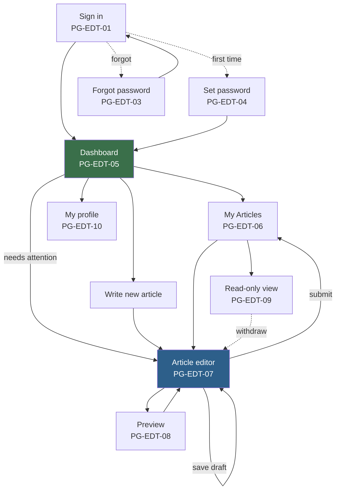
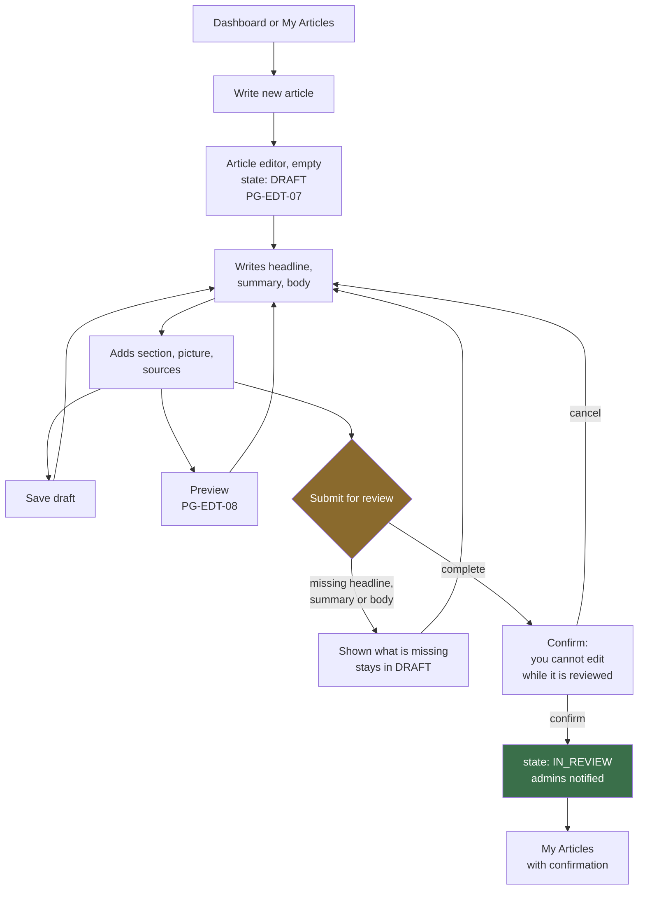
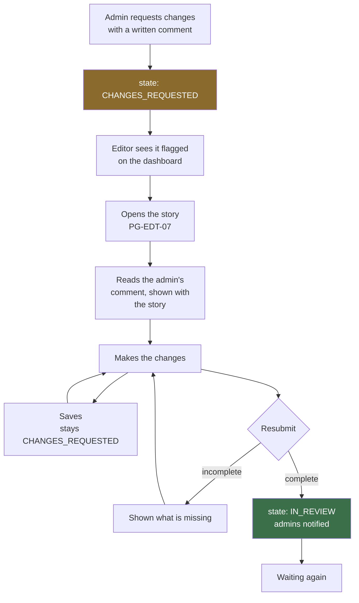

# 09 — Editor Flow

**Stage:** Phase 2 — product mapping
**Last updated:** 2026-09-08
**Covers:** everything an editor does, from first sign-in to seeing their story live

Labels: **[CONFIRMED] / [PROVISIONAL] / [FUTURE] / [NEW ISSUE]** — see `07-product-map.md`.

---

## 0. The editor's mental model

An editor thinks about exactly two things:

1. **What am I working on?**
2. **What is waiting for me?**

Every screen in the editor area should answer one of those in under a second. The
state of each story — *drafting, waiting, needs my attention, published* — is the
single most important piece of information in this whole area.

**[CONFIRMED]** There is no publish button anywhere in the editor's world. Not
hidden, not disabled, not conditional. It does not exist.

---

## 1. Editor navigation map



Dotted lines are conditional on open questions: withdrawing depends on OQ-04, and
the read-only view exists only if articles are locked during review (OQ-03).

---

## 2. Getting in

### E-01 — First time — [PROVISIONAL, OQ-27]

```
Admin creates the account
        |
        v
Editor receives an invitation
        |
        v
Sets their own password  [PG-EDT-04]
        |
        v
Signs in  [PG-EDT-01]
        |
        v
Dashboard  [PG-EDT-05]
```

**Why an invitation rather than an admin-set password:** an admin who types a
password knows it. For accounts that write the publication's content, the person
using the account should be the only one who has ever known its password.

### E-02 — Signing in day to day

**Starts:** the sign-in page *(PG-EDT-01)*.
**Sees:** email and password fields. Nothing else — no hint about who works here,
no list of users.
**Actions and destinations:**

| Action | Result |
|---|---|
| Correct details | Dashboard *(PG-EDT-05)* |
| Correct details, two-step enabled | Verification *(PG-EDT-02)* → Dashboard — **[PROVISIONAL — OQ-28]** |
| Wrong details | Same page, one generic message |
| Forgot password | *(PG-EDT-03)* |
| Deactivated account | Same generic message — **[PROVISIONAL — NEW ISSUE P2-11]** |

**[CONFIRMED — SEC-09]** Repeated failures are slowed down or blocked.
**[PROVISIONAL]** The failure message never distinguishes "no such account" from
"wrong password" from "account disabled". Any difference tells a stranger which
email addresses belong to staff.

### E-03 — Arriving at the dashboard

**[NEW ISSUE P2-06]** Phase 1 never specified what a dashboard contains. Proposed
minimum, needing confirmation:

- **Needs your attention** — stories sent back with changes requested *(the most
  important thing on the page)*
- **In progress** — recent drafts, most recently edited first
- **Waiting for review** — submitted, no action possible
- **Recently published** — the reward, and a link to the live story
- **Write a new article** — one obvious button

**[PROVISIONAL]** If there is nothing at all, the dashboard shows a single clear
invitation to write the first story, not an empty grid.

---

## 3. The main journey — writing and submitting



### Step by step

#### Create
**Starts:** "Write a new article" from the dashboard or My Articles.
**Result:** the article editor opens empty. **[PROVISIONAL]** The story exists as
a `DRAFT` from the first save, not from the moment the page opens — otherwise
every abandoned click leaves an empty story behind.

#### Write *(PG-EDT-07)*
**Fields** — **[PROVISIONAL — OQ-22 governs the body format]**:

| Field | Required to submit? | Open question |
|---|---|---|
| Headline | Yes — `BR-09` | |
| Summary | Yes — `BR-09` | |
| Body | Yes — `BR-09` | OQ-22 |
| Section | **[PROVISIONAL]** Yes | OQ-18 |
| Featured picture + description of it | **[PROVISIONAL]** Yes | OQ-21 |
| Picture credit | **[PROVISIONAL]** Yes | OQ-21 |
| Sources | **[PROVISIONAL]** No | OQ-24 |
| Search-engine title and description | No — falls back to headline and summary | |

**While writing:**
- **Save draft** — explicit, always available **[CONFIRMED — EDT-05]**
- **Automatic saving** in the background **[PROVISIONAL — OQ-26]**, with a visible
  "saved" indicator. Silent autosave that fails silently is worse than none.
- **Leaving with unsaved work** produces a warning **[PROVISIONAL]**

#### Preview *(PG-EDT-08)*
Shows the story as a reader would see it. **[CONFIRMED — SEC-03]** The preview
must not be reachable by anyone who is not signed in and entitled to see the
story. **[NEW ISSUE P2-07]** How preview addresses work is a real decision with
a real leak risk attached, and Phase 1 did not cover it.

#### Submit for review
1. The system checks headline, summary and body are present **[CONFIRMED — BR-09]**
2. **[PROVISIONAL]** A confirmation step explains that the story cannot be edited
   while it is being reviewed *(this exists only because of OQ-03)*
3. The story moves to `IN_REVIEW` **[CONFIRMED]**
4. Admins are notified **[PROVISIONAL — OQ-25]**
5. The editor lands back on My Articles with clear confirmation

**[CONFIRMED]** Nothing about this makes anything public — `BR-04`.

---

## 4. Waiting

**Sees:** the story listed as *Waiting for review*, with the time it was submitted.

**Can do:**

| Action | Available? |
|---|---|
| Read the story | Yes |
| Edit it | **[PROVISIONAL — OQ-03]** No. Locked while an admin may be reading it. |
| Withdraw it | **[PROVISIONAL — OQ-04]** Yes, returning it to `DRAFT` |
| Start a different story | Yes |

**Why locking is proposed:** if the text can change while an admin is reading it,
the admin may approve something different from what they read. That is a
correctness problem, not an inconvenience.

**Why withdrawing is proposed alongside it:** without it, an editor who spots
their own mistake must ask an admin to reject their own story — wasting the
admin's time and filling the record with rejections that were never editorial
decisions.

**[NEW ISSUE P2-12]** Nobody has decided whether the editor can see *which* admin
has the story, or how long it has been waiting. In a newsroom, "who has my story
and for how long" is asked constantly.

---

## 5. Changes requested — the loop that must work well



**What the editor sees:** the admin's comment displayed **with the story**, not
in a separate inbox. **[CONFIRMED — BR-07]** The comment can never be empty —
"sent back with no explanation" is the most common source of newsroom friction,
and the product prevents it rather than relying on good manners.

**[PROVISIONAL — OQ-25]** Previous rounds of feedback remain visible, so on the
third revision an editor can still see what was asked for on the first. Whether
this is a simple list or a full conversation is undecided.

**Resubmitting** runs the same checks as the first submission and returns the
story to `IN_REVIEW`.

---

## 6. The three outcomes

### E-06 — Rejected

**Sees:** the story marked *Rejected*, with the admin's reason **[CONFIRMED — BR-08]**.

**Can do:** read it, read the reason, and — **[PROVISIONAL — OQ-15]** — nothing
else. Only an admin can reopen a rejected story.

**Why this matters to get right:** *rejected* and *changes requested* must look
and feel clearly different. One means "fix this and send it back"; the other
means "we are not running this". If an editor confuses them, they either waste a
day revising a dead story or abandon one that only needed a correction.

**[NEW ISSUE P2-13]** Whether an editor can ask for a rejection to be
reconsidered — and how — is undefined. Today the answer is "talk to your editor
in person", which may be perfectly fine, but should be a decision rather than an
omission.

### E-07 — Approved and published

**Sees:** the story marked *Published*, with the time and a link to the live page.

**Can do:** view it live. **[PROVISIONAL — OQ-08]** Editing a published story
does not change what the public is reading — it starts a **correction**, which
goes through review exactly like a new story and only replaces the live version
when an admin approves it.

This is the point where OQ-08 stops being abstract: the answer determines whether
the *Published* list is a read-only archive or an active workspace.

### E-08 — Published, then withdrawn — [PROVISIONAL, OQ-16]

The story shows as *Withdrawn* or *Archived*. The editor cannot restore it. An
admin took it down and only an admin can put it back.

**[NEW ISSUE P2-14]** Whether the editor is told *why* their published story was
taken down is undefined. For anything more serious than a typo, they almost
certainly should be.

---

## 7. Other things editors do

### E-09 — Finding a story
My Articles *(PG-EDT-06)* lists their own stories. **[PROVISIONAL — OQ-05]**
Editors see only their own work; they cannot browse other editors' drafts.
Filters: by state, by section, by date; search by headline.

### E-10 — Profile *(PG-EDT-10)*
Change their own display name, password, and **[PROVISIONAL — OQ-23]** the name
shown to readers if that is separated from the account. They cannot change their
own role — **[CONFIRMED]** no self-promotion, ever.

### E-11 — Signed out mid-edit
**[PROVISIONAL — NEW ISSUE P2-15]** Sessions expire *(SEC-05)*. An editor whose
session ends while writing must not lose their work. At minimum, unsaved text is
preserved and restored after signing in again. Losing a finished story to a
timeout is the fastest way to lose a newsroom's trust in the tool.

### E-12 — An admin edited my story
**[PROVISIONAL — OQ-02]** Phase 1 recommends admins can edit editors' stories,
with the change recorded and the editor notified. The editor sees that an admin
made changes and when. **[NEW ISSUE P2-16]** Whether they can see *what* changed
depends on OQ-26 *(are revisions kept?)*.

---

## 8. What an editor can never do

**[CONFIRMED]** By any route — a button, a guessed address, or a request made
outside the interface:

| Cannot | Rule |
|---|---|
| Publish anything | `BR-05` |
| Approve or reject anything, including their own work | `BR-02` |
| Change an article's state to `PUBLISHED` | `BR-10` |
| Edit another editor's article | **[PROVISIONAL — OQ-05]** |
| See another editor's unpublished work | **[PROVISIONAL — OQ-05]** |
| Change their own or anyone else's role | `USR-02` |
| Create, verify or delete sources | **[PROVISIONAL — OQ-14]** — editors may *create*, only admins verify |
| Manage sections or settings | `ADM-10` |
| See the audit trail | `03` §3.3 |
| Unpublish, archive or delete anything | `ADM-12` |

**[CONFIRMED — SEC-01, SEC-02]** Every one of these is refused by the system
itself. Hiding the buttons is courtesy; the refusal is the control.

---

## 9. Traceability

| Journey | Pages | Requirements | States |
|---|---|---|---|
| E-01 First sign-in | PG-EDT-04, 01 | USR-01, USR-05 | — |
| E-02 Sign in | PG-EDT-01, 02 | CAP-01, EDT-01, SEC-09 | — |
| E-03 Dashboard | PG-EDT-05 | EDT-02 | — |
| E-04 Write | PG-EDT-07 | EDT-03, EDT-04, EDT-06, EDT-15 | DRAFT |
| E-05 Preview | PG-EDT-08 | EDT-12, SEC-03 | any |
| E-06 Submit | PG-EDT-07 | EDT-07, BR-09, BR-04 | DRAFT → IN_REVIEW |
| E-07 Waiting | PG-EDT-06, 09 | EDT-14 | IN_REVIEW |
| E-08 Changes requested | PG-EDT-05, 07 | EDT-09, EDT-10, BR-07 | CHANGES_REQUESTED → IN_REVIEW |
| E-09 Rejected | PG-EDT-06 | EDT-11, BR-08 | REJECTED |
| E-10 Published | PG-EDT-06 | EDT-13 | PUBLISHED |
| E-11 Profile | PG-EDT-10 | USR-04 | — |
