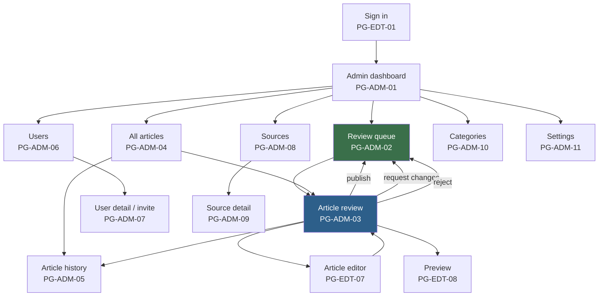
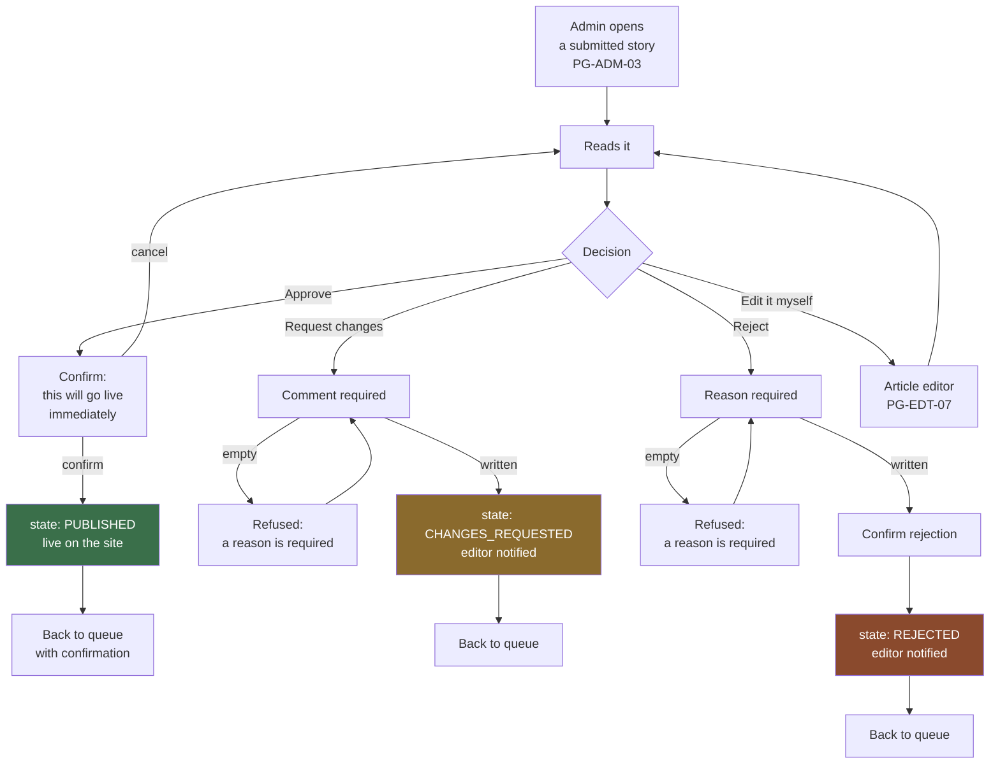

# 10 — Admin Flow

**Stage:** Phase 2 — product mapping
**Last updated:** 2026-09-08
**Covers:** everything an admin does — reviewing, publishing, and running the newsroom

Labels: **[CONFIRMED] / [PROVISIONAL] / [FUTURE] / [NEW ISSUE]** — see `07-product-map.md`.

---

## 0. The admin's mental model

An admin does two very different jobs, and the product should keep them apart:

1. **Deciding** — reading submitted stories and choosing publish, send back, or
   reject. This happens many times a day, often under time pressure.
2. **Running the newsroom** — staff, sections, sources, settings. This happens
   occasionally.

Job 1 is the main workspace. Job 2 lives behind it and must never get in the way.

**[CONFIRMED]** Publishing is the one irreversible-feeling act in the product.
Everything around it should be deliberate, unambiguous, and recorded.

---

## 1. Admin navigation map



---

## 2. Getting in and getting oriented

### A-01 — Signing in
Identical page to the editor's *(PG-EDT-01)*. **[PROVISIONAL — NEW ISSUE P2-04]**
One sign-in page for all staff; the role decides where they land. A separate
admin sign-in page adds a second thing to secure and advertises where the
valuable accounts are.

**[PROVISIONAL — OQ-28]** Two-step verification is strongly recommended here
specifically. A stolen admin account can publish anything on the publication's
masthead — that is a reputational event, not merely a security incident.

### A-02 — The dashboard *(PG-ADM-01)*

**[NEW ISSUE P2-06]** Phase 1 did not specify dashboard content. Proposed
minimum, needing confirmation:

- **Waiting for review** — the count, and the oldest few, most-waiting-first
- **Recently published** — what went out today, and who published it
- **Anything sent back** — stories with editors, so nothing is forgotten
- **Newsroom at a glance** — drafts in progress, active staff

**[PROVISIONAL]** The most useful single number on this page is *how long the
oldest submission has been waiting*. An editor waiting three hours for a decision
is the failure mode this dashboard exists to prevent.

---

## 3. The core loop — reviewing and deciding

### A-03 — The review queue *(PG-ADM-02)*

**Sees:** every story in `IN_REVIEW`, **[PROVISIONAL]** oldest first — so the
longest-waiting editor is served first, not the most recent submission.

Per row: headline, author, section, time submitted, how long it has waited, and
whether it has been sent back before *(a third-round story deserves a closer
look)*.

**Can do:** open one for review; filter by section or author; sort.

**Empty queue** is a success state, not an absence — it should read as "nothing
is waiting", not as a blank page.

### A-04 — Reviewing a story *(PG-ADM-03)*

**Sees:** the complete story as a reader would see it **[CONFIRMED — ADM-03]**,
plus what a reader would not: author, submission time, section, sources, picture
credit, previous rounds of feedback, and — **[PROVISIONAL — OQ-26]** — what
changed since the last submission.

**That last point matters more than it looks.** Without it, every round of review
means re-reading the whole story. Review quality falls as stories get longer and
as the day gets later.

**Three decisions, and three only:**



#### Approve and publish
**[PROVISIONAL]** In V1 these are one action — "Approve & publish" — because a
separate second click serves no purpose until scheduling exists *(OQ-07)*. The
`APPROVED` state still exists underneath, so scheduling can be added later
without changing every rule that currently assumes approved means live.

**[PROVISIONAL]** A confirmation step precedes it. This is the one place in the
product where a mis-click is publicly visible within seconds.

**On publishing** **[CONFIRMED — BR-06]**: the publishing admin and the time are
recorded; the story becomes publicly readable; its address is fixed permanently
*(BR-15)*; it enters the homepage, its section, the news feed and the sitemap.

**[CONFIRMED — `BR-13`, resolved 2026-09-09]** An admin **cannot** approve or
publish a story they wrote or last revised. The approve and publish controls are
unavailable on their own stories, and the server refuses the action regardless of
how the request arrives. A second admin must review it. Rationale and accepted
costs: `03` §6.1. *(This reverses the earlier `OQ-29` recommendation; `P2-01` is
closed.)*

#### Request changes
A comment is mandatory **[CONFIRMED — BR-07]** and the system refuses an empty
one. The story returns to the editor; the admin returns to the queue.

#### Reject
A reason is mandatory **[CONFIRMED — BR-08]**. **[PROVISIONAL]** Rejection asks
for confirmation, because to the editor it reads as "we are not running your
story" — a heavier message than sending it back.

**[PROVISIONAL — OQ-15]** Only an admin can reopen a rejected story.

### A-05 — Editing an editor's story — [PROVISIONAL, OQ-02]

Phase 1 recommends admins may edit directly, with the change recorded and the
editor notified — this is ordinary sub-editing practice.

**[NEW ISSUE P2-17]** What is *not* decided: whether an admin can edit and
publish in one motion. If they can, the review step becomes "rewrite and publish"
and the byline may no longer match the text. A recorded, notified edit is the
minimum; whether it needs anything more is your call.

---

## 4. Managing published stories

### A-06 — All articles *(PG-ADM-04)*
Every story in every state **[PROVISIONAL — ADM-07]**, filterable by state,
author, section and date, searchable by headline. This page is also the answer to
"manage published articles" — a filter, not a separate screen.

### A-07 — Correcting a published story — [PROVISIONAL, OQ-08]

The recommended model: the live version stays up while the correction is written
and reviewed, then replaces it on approval.

```
Published story
      |
   correct
      |
      v
New revision, private          <- public still reads the original
      |
   submitted, reviewed
      |
   approved
      |
      v
Corrected version replaces the live one instantly
```

**[PROVISIONAL]** Phase 1 also floats an admin-only fast path for typo-level
fixes that goes live immediately but is recorded as a direct edit. This keeps
newsroom reality workable without opening the door to editors — **[NEW ISSUE
P2-18]** but "what counts as a typo" is a judgement no software can make, so the
boundary needs stating.

**[PROVISIONAL — OQ-09]** Material corrections show readers an update notice.

### A-08 — Withdrawing a published story — [PROVISIONAL, OQ-16]
Available from the review page or All Articles. Requires a reason, asks for
confirmation, and removes the story from the site, listings, feed and sitemap
**[CONFIRMED — SEO-14]**.

**[PROVISIONAL]** This must be fast to reach. When a story has to come down, it
usually has to come down *now* — a legal demand or a serious factual error does
not wait for someone to find the right screen.

### A-09 — Archive and restore — [PROVISIONAL, OQ-13]
Retires a story from active work while keeping it on record. An admin can restore
it to `DRAFT`.

**[NEW ISSUE P2-19]** `ARCHIVED` currently means two different things — "was
published and taken down" and "was never published and abandoned". An admin
looking at the archive cannot tell them apart, and readers are affected by only
one of them. This needs separating.

### A-10 — Article history *(PG-ADM-05)* — [PROVISIONAL, OQ-11]
Every state change with who, when, from what to what, and any comment given.
Append-only; no role can edit it **[CONFIRMED — SEC-11]**.

**Why it cannot wait:** this record cannot be reconstructed afterwards. If it is
not built before the first story is published, those months simply have no
history — and "who approved this?" is precisely the question asked when something
goes wrong.

---

## 5. Running the newsroom

### A-11 — Users and editors *(PG-ADM-06, PG-ADM-07)*

**[PROVISIONAL — P2-04]** One Users page with a role filter, not separate "Users"
and "Editors" pages. Same capability, half the screens.

| Action | Flow |
|---|---|
| Invite someone | Users → Invite → email + role → invitation sent → shows as pending |
| Change a role | User detail → change → confirm → recorded |
| Deactivate | User detail → deactivate → confirm → sessions ended **[CONFIRMED — SEC-05]** |
| Reactivate | User detail → reactivate |

**[CONFIRMED — BR-14]** The last active admin cannot be deactivated or demoted.
The system must refuse it, not merely discourage it — an admin-less newsroom
cannot publish and cannot fix itself.

**[CONFIRMED — USR-03]** Deactivation, never deletion. Removing an account must
never erase the stories that person wrote or the decisions they made.

**[NEW ISSUE P2-20]** What happens to a deactivated editor's in-flight work is
undefined. Their drafts and submissions do not stop existing when they leave, and
someone has to be able to finish or publish them.

### A-12 — Sources *(PG-ADM-08, PG-ADM-09)* — [PROVISIONAL, OQ-14]

**[CONFIRMED — CAP-11]** Sources are entered and maintained by hand. Nothing is
fetched automatically.

| Action | Who |
|---|---|
| Create a source | **[PROVISIONAL]** Editors and admins |
| Edit or delete | Admins only |
| Mark as verified | **[PROVISIONAL]** Admins only |

**Why verification is admin-only:** marking a source verified is an editorial
judgement carrying real credibility weight. It should not be self-assigned by
whoever happens to be writing at the time.

**[PROVISIONAL]** A source cited by a published story is never hard-deleted. A
citation has to keep making sense years later.

### A-13 — Categories *(PG-ADM-10)* — [PROVISIONAL, OQ-18]
Create, rename, reorder, deactivate. **[NEW ISSUE P2-21]** Deleting a section
that still contains published stories must be prevented or handled — those
stories have public addresses built from the section name *(OQ-20)*, so deleting
one can break every link in it.

### A-14 — Settings *(PG-ADM-11)*
**[NEW ISSUE P2-08]** Phase 1 never defined what site settings exist. Proposed
minimum: publication name, logo, contact email, timezone for publication times
*(OQ-42)*, default search-engine description, social accounts, footer links.
Everything beyond that needs justification.

---

## 6. Requested but not in V1

The Phase 2 brief asked for these admin workflows. Phase 1 places them in the
future, so rather than quietly adding them:

| Workflow | Why not in V1 | Question |
|---|---|---|
| Managing tags | Tags are future work; nothing in V1 uses them | — |
| Managing media | V1 attaches one picture per story directly; a library is worth building once pictures are numerous enough to lose | OQ-21 |
| Scheduling publication | Introduces the first process that acts with nobody logged in | OQ-07 |
| Curating the homepage | V1 is strictly newest-first | OQ-17 |
| Analytics | Needs traffic that does not exist yet | OQ-34 |
| Full activity log | Per-article history is the V1 version | OQ-11 |

---

## 7. What an admin cannot do

**[CONFIRMED]** Even the most powerful role has limits, and they exist for a
reason:

| Cannot | Why |
|---|---|
| Edit or delete the audit trail | A record that can be rewritten is not a record — `SEC-11` |
| Deactivate the last active admin | Would leave the newsroom unable to publish — `BR-14` |
| Permanently delete by default | Retention is the default; true deletion is deliberate, rare and recorded — `BR-12`, OQ-12 |
| Bypass the state rules | Only the transitions in `11-article-workflows.md` are legal — `BR-10` |
| Publish without it being recorded | `BR-06` |

---

## 8. Traceability

| Journey | Pages | Requirements | States |
|---|---|---|---|
| A-01 Sign in | PG-EDT-01, 02 | CAP-01, ADM-01 | — |
| A-02 Dashboard | PG-ADM-01 | ADM-02 | — |
| A-03 Queue | PG-ADM-02 | CAP-04, ADM-02 | IN_REVIEW |
| A-04 Review | PG-ADM-03 | CAP-05, ADM-03 | IN_REVIEW |
| A-04a Publish | PG-ADM-03 | CAP-05, BR-02, BR-06 | IN_REVIEW → PUBLISHED |
| A-04b Request changes | PG-ADM-03 | CAP-07, BR-07 | IN_REVIEW → CHANGES_REQUESTED |
| A-04c Reject | PG-ADM-03 | CAP-06, BR-08 | IN_REVIEW → REJECTED |
| A-05 Admin edits | PG-EDT-07 | ADM-13 | any unpublished |
| A-06 All articles | PG-ADM-04 | ADM-07, ADM-08 | all |
| A-07 Correction | PG-EDT-07, PG-ADM-03 | CAP-16, BR-16 | PUBLISHED + new revision |
| A-08 Withdraw | PG-ADM-03/04 | CAP-17, ADM-12, SEO-14 | PUBLISHED → ARCHIVED |
| A-10 History | PG-ADM-05 | CAP-15, ADM-14, SEC-11 | — |
| A-11 Users | PG-ADM-06, 07 | CAP-13, ADM-09, BR-14 | — |
| A-12 Sources | PG-ADM-08, 09 | CAP-11, ADM-11, SRC-01..07 | — |
| A-13 Categories | PG-ADM-10 | CAP-14, ADM-10 | — |
