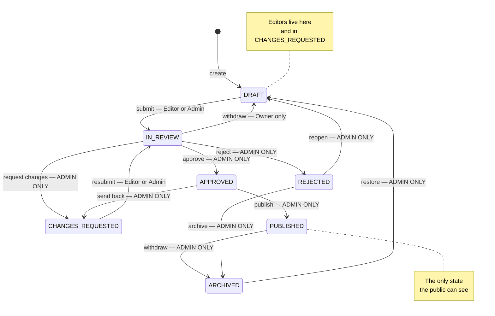
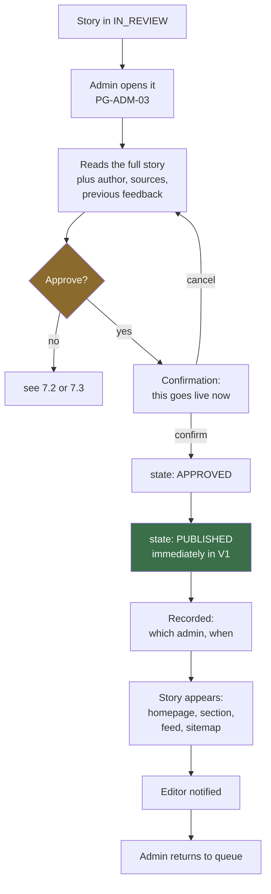
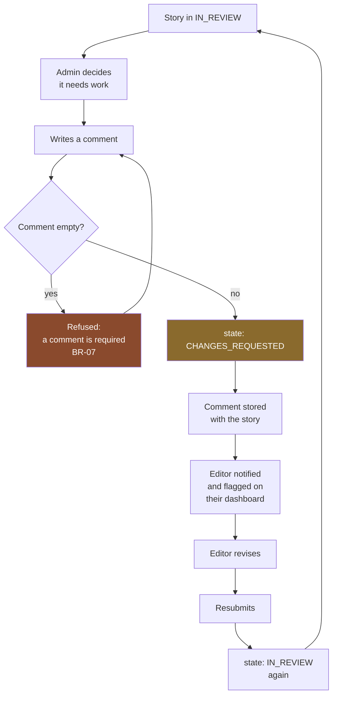
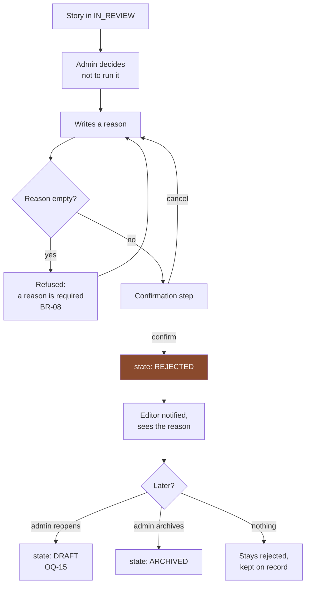
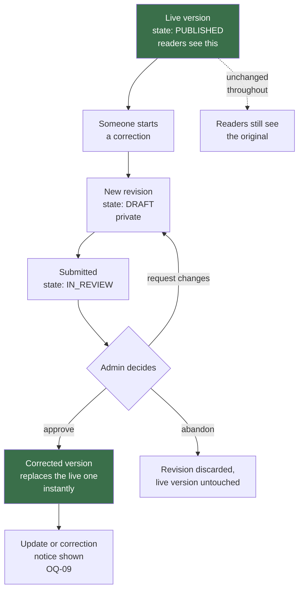

# 11 — Article Workflows and State Machine

**Stage:** Phase 2 — product mapping
**Last updated:** 2026-09-08
**Covers:** exactly what a story can do next, who is allowed to make it happen, and what the public sees at each point

This is the most precise document in the set. Everything here becomes a rule the
system enforces and a test that proves it.

Labels: **[CONFIRMED] / [PROVISIONAL] / [FUTURE] / [NEW ISSUE]**.

---

## 0. The two rules everything else serves

**[CONFIRMED]**

1. **A story is publicly visible in exactly one state: `PUBLISHED`.** — `BR-01`
2. **Only an admin can move a story into that state.** — `BR-02`, `BR-05`

Every table below exists to make those two statements impossible to violate.

---

## 1. The states

| State | Plain meaning | Public? | Who may edit the text | Who may move it on |
|---|---|---|---|---|
| `DRAFT` | Being written | No | Owner, Admin | Owner, Admin |
| `IN_REVIEW` | Submitted, waiting for a decision | No | **[PROVISIONAL]** Nobody *(OQ-03)*; Admin may edit | Admin only; Owner may withdraw *(OQ-04)* |
| `CHANGES_REQUESTED` | Sent back with notes | No | Owner, Admin | Owner, Admin |
| `APPROVED` | Accepted, not yet live | No | Admin | Admin only |
| `PUBLISHED` | Live on the site | **Yes** | **[PROVISIONAL]** Nobody directly *(OQ-08)* | Admin only |
| `REJECTED` | Declined | No | Nobody | Admin only |
| `ARCHIVED` | Retired, retained | No | Nobody | Admin only |

**[NEW ISSUE P2-24]** In V1, `APPROVED` is passed through instantly because
approve-and-publish is a single action. It exists so that scheduling *(OQ-07)*
can be added later without rewriting every rule that assumes "approved means
live". If you would rather not carry a state nobody sees, say so — but the cost
of adding it later is far higher than the cost of carrying it now.

**[NEW ISSUE P2-22 — contradiction between the Phase 2 brief and Phase 1]**
The Phase 2 brief's example describes two separate states — `SUBMITTED` and
`UNDER_REVIEW`, with an admin moving a story from one to the other. Phase 1
defined a **single** `IN_REVIEW` state. This document follows **Phase 1**, as
instructed, and records the difference rather than resolving it. See §9.

---

## 2. State-by-state detail

### `DRAFT`

| | |
|---|---|
| **Who can enter it** | Editor, Admin |
| **How it is entered** | Creating a story *(T1)*; withdrawing a submission *(T7)*; an admin reopening a rejected story *(T14)*; an admin restoring an archived one *(T16)*; **[PROVISIONAL]** starting a correction to a published story *(T13)* |
| **Who can modify the text** | The owning editor; an admin **[PROVISIONAL — OQ-02]** |
| **Who can transition it** | Owner *(submit)*; Admin *(submit, archive)* |
| **What happens next** | Usually `IN_REVIEW`. It may also sit indefinitely — a draft is allowed to be abandoned. |
| **What the reader sees** | Nothing. The story does not exist as far as the public is concerned. **[CONFIRMED — SEC-03]** A guessed address must be indistinguishable from an address that never existed. |

### `IN_REVIEW`

| | |
|---|---|
| **Who can enter it** | Editor *(submitting or resubmitting)*, Admin |
| **How it is entered** | `T3` submit, `T9` resubmit |
| **Requirements to enter** | Headline, summary and body must be present **[CONFIRMED — BR-09]** |
| **Who can modify the text** | **[PROVISIONAL — OQ-03]** Nobody. Locked so an admin cannot approve text that changed while they were reading it. An admin may still edit **[PROVISIONAL — OQ-02]** |
| **Who can transition it** | **Admin only** — approve, request changes, reject. The owner may withdraw **[PROVISIONAL — OQ-04]** |
| **What happens next** | `APPROVED`, `CHANGES_REQUESTED`, `REJECTED`, or back to `DRAFT` if withdrawn |
| **What the reader sees** | Nothing |

**[NEW ISSUE P2-23]** Nothing prevents two admins opening and deciding the same
story at once. The second decision would land on a story that has already moved.
At minimum the system must refuse the second action cleanly rather than
corrupting the state; whether it should also show "someone is reviewing this" is
a product decision.

### `CHANGES_REQUESTED`

| | |
|---|---|
| **Who can enter it** | Admin only |
| **How it is entered** | `T4` from `IN_REVIEW`; `T11` from `APPROVED` |
| **Requirements to enter** | A non-empty comment **[CONFIRMED — BR-07]** |
| **Who can modify the text** | The owning editor; an admin |
| **Who can transition it** | Owner *(resubmit)*; Admin *(resubmit, reject, archive)* |
| **What happens next** | Back to `IN_REVIEW` once the editor resubmits |
| **What the reader sees** | Nothing |

### `APPROVED`

| | |
|---|---|
| **Who can enter it** | Admin only |
| **How it is entered** | `T5` from `IN_REVIEW` |
| **Who can modify the text** | Admin only |
| **Who can transition it** | Admin only |
| **What happens next** | `PUBLISHED` *(immediately in V1)*, or back to `CHANGES_REQUESTED` |
| **What the reader sees** | Nothing — **approved is not published** |

### `PUBLISHED`

| | |
|---|---|
| **Who can enter it** | **Admin only** **[CONFIRMED — BR-02]** |
| **How it is entered** | `T10` from `APPROVED` |
| **Recorded on entry** | Which admin, and when **[CONFIRMED — BR-06]** |
| **Who can modify the text** | **[PROVISIONAL — OQ-08]** Nobody directly. Changes create a new revision that goes through review; the live version stays untouched until that revision is approved *(BR-16)*. |
| **Who can transition it** | Admin only — withdraw |
| **What happens next** | Stays published; or `ARCHIVED` if withdrawn; or its text is replaced by an approved correction |
| **What the reader sees** | **The full story.** It appears on the homepage, its section page, the news feed and the sitemap. |

**Fixed at publication** **[CONFIRMED — BR-15]**: the story's public address never
changes afterwards, even if the headline is corrected. Addresses that have been
shared and indexed are public promises.

### `REJECTED`

| | |
|---|---|
| **Who can enter it** | Admin only |
| **How it is entered** | `T6` from `IN_REVIEW` |
| **Requirements to enter** | A non-empty reason **[CONFIRMED — BR-08]** |
| **Who can modify the text** | Nobody |
| **Who can transition it** | Admin only **[PROVISIONAL — OQ-15]** |
| **What happens next** | Reopened to `DRAFT`, or archived |
| **What the reader sees** | Nothing |

### `ARCHIVED`

| | |
|---|---|
| **Who can enter it** | Admin only |
| **How it is entered** | `T12` withdrawn from published; `T15` from rejected; **[PROVISIONAL]** from abandoned drafts |
| **Who can modify the text** | Nobody |
| **Who can transition it** | Admin only |
| **What happens next** | Restored to `DRAFT`, or left permanently |
| **What the reader sees** | Nothing. **[PROVISIONAL — OQ-16]** If it was previously published, either a "page not found" or a withdrawal notice — this must be decided. |

**[NEW ISSUE P2-19]** `ARCHIVED` currently means two different things: *was
published and taken down* and *was never published and abandoned*. Only the first
affects readers, search engines and the sitemap. They should be distinguishable.

---

## 3. The complete state machine



---

## 4. Every valid transition

**[CONFIRMED]** Anything not in this table is refused — `BR-10`.

| # | From | Action | To | Editor *(owner)* | Editor *(other)* | Admin | Requires |
|---|---|---|---|---|---|---|---|
| T1 | — | Create | `DRAFT` | ✅ | ✅ | ✅ | — |
| T2 | `DRAFT` | Save | `DRAFT` | ✅ | ❌ | ✅ | — |
| T3 | `DRAFT` | Submit | `IN_REVIEW` | ✅ | ❌ | ✅ | BR-09 |
| T4 | `IN_REVIEW` | Request changes | `CHANGES_REQUESTED` | ❌ | ❌ | ✅ | BR-07 comment |
| T5 | `IN_REVIEW` | Approve | `APPROVED` | ❌ | ❌ | ✅ *(not the author/last reviser)* | **BR-13** |
| T6 | `IN_REVIEW` | Reject | `REJECTED` | ❌ | ❌ | ✅ | BR-08 reason |
| T7 | `IN_REVIEW` | Withdraw | `DRAFT` | ⚠️ OQ-04 | ❌ | ✅ | — |
| T8 | `CHANGES_REQUESTED` | Save | `CHANGES_REQUESTED` | ✅ | ❌ | ✅ | — |
| T9 | `CHANGES_REQUESTED` | Resubmit | `IN_REVIEW` | ✅ | ❌ | ✅ | BR-09 |
| T10 | `APPROVED` | **Publish** | `PUBLISHED` | ❌ | ❌ | ✅ | BR-02, BR-06 |
| T11 | `APPROVED` | Send back | `CHANGES_REQUESTED` | ❌ | ❌ | ✅ | comment |
| T12 | `PUBLISHED` | Withdraw | `ARCHIVED` | ❌ | ❌ | ⚠️ OQ-16 | reason |
| T13 | `PUBLISHED` | Start correction | new revision, `DRAFT` | ⚠️ OQ-08 | ❌ | ⚠️ OQ-08 | live version untouched |
| T14 | `REJECTED` | Reopen | `DRAFT` | ❌ | ❌ | ⚠️ OQ-15 | — |
| T15 | `REJECTED` | Archive | `ARCHIVED` | ❌ | ❌ | ⚠️ OQ-13 | — |
| T16 | `ARCHIVED` | Restore | `DRAFT` | ❌ | ❌ | ⚠️ OQ-13 | — |
| T17 | `APPROVED` | Schedule | `APPROVED` + time | ❌ | ❌ | **[FUTURE]** | OQ-07 |

✅ allowed · ❌ refused · ⚠️ depends on an unanswered question

---

## 5. Every invalid transition — and what must happen instead

This table matters as much as the previous one. These are the moves the system
must actively refuse, not merely fail to offer.

### 5.1 Absolutely forbidden for editors

| Attempted | Why it must fail | What must happen |
|---|---|---|
| `DRAFT` → `PUBLISHED` | **The core rule of the product.** `BR-05` | Refused by the system, recorded as a refused attempt |
| `IN_REVIEW` → `PUBLISHED` | Same | Refused |
| `IN_REVIEW` → `APPROVED` | Editors cannot approve — `BR-02` | Refused |
| `IN_REVIEW` → `REJECTED` | Editors cannot reject | Refused |
| `IN_REVIEW` → `CHANGES_REQUESTED` | Editors cannot review | Refused |
| `CHANGES_REQUESTED` → `PUBLISHED` | Skips review entirely | Refused |
| `APPROVED` → `PUBLISHED` | Publishing is admin-only, even for an approved story | Refused |
| `PUBLISHED` → anything | Editors cannot withdraw or archive | Refused |
| `REJECTED` → `DRAFT` | Only an admin reopens — **[PROVISIONAL — OQ-15]** | Refused |
| Any transition on another editor's story | **[PROVISIONAL — OQ-05]** | Refused, and the story's existence not revealed |

**[CONFIRMED — SEC-01, SEC-02]** Every one of these must be refused by the system
itself, on every request, regardless of how the request arrives. An editor who
never opens the interface at all — who sends a request directly — meets exactly
the same refusal. Hiding the button is not the control; it is a courtesy on top
of the control.

### 5.2 Nonsensical for anyone, including admins

| Attempted | Why |
|---|---|
| `DRAFT` → `APPROVED` | Skips review; nobody has read it |
| `DRAFT` → `PUBLISHED` | Skips review entirely, even for an admin |
| `DRAFT` → `REJECTED` | Nothing has been submitted to reject |
| `DRAFT` → `CHANGES_REQUESTED` | No review has taken place |
| `PUBLISHED` → `IN_REVIEW` | Would remove a live story from the public without a decision to do so |
| `PUBLISHED` → `DRAFT` | Same — corrections use `T13` instead, leaving the live version up |
| `REJECTED` → `PUBLISHED` | Publishing something explicitly declined |
| `ARCHIVED` → `PUBLISHED` | Republishing without review; must go through `DRAFT` |
| Any transition on a story that has already moved | Two admins acting at once — **[NEW ISSUE P2-23]** |

**[CONFIRMED — resolved 2026-09-09]** Note the admin restriction in row 2: an admin
writing their own story still has to submit it, **and a *different* admin must
approve it** (`BR-13`). That keeps one path through the system rather than two, and
it means the record shows a review actually happened rather than merely being
logged. The cost — a lone admin at midnight cannot publish their own writing — is
accepted deliberately; see `03` §6.1.

---

## 6. Who can do what — the authorisation summary

```
                     Editor      Editor       Admin
                     (owner)     (other)
Create                 YES         YES          YES
Save own draft         YES         NO           YES
Submit                 YES         NO           YES
Withdraw               OQ-04       NO           YES
Approve                NO          NO           YES   <-- the boundary
Publish                NO          NO           YES   <-- the boundary
Request changes        NO          NO           YES
Reject                 NO          NO           YES
Withdraw published     NO          NO           OQ-16
Reopen rejected        NO          NO           OQ-15
Archive / restore      NO          NO           OQ-13
View unpublished       own only    OQ-05        all
```

The two lines marked "the boundary" are the product. Everything else is
configurable detail; those two are not.

---

## 7. The three decision flows in detail

### 7.1 Approval and publication



**What must be true at step G** **[CONFIRMED]**: the acting user is an admin
*(BR-02)*; the story was in `IN_REVIEW`; the publishing admin and time are
recorded *(BR-06)*; the public address is fixed *(BR-15)*.

### 7.2 Request changes



**[PROVISIONAL — OQ-25]** Earlier rounds of feedback stay visible, so on a third
revision both sides can still see what was asked for on the first.

### 7.3 Rejection



**The editor cannot revive it themselves** **[PROVISIONAL — OQ-15]**. That is the
distinction from *changes requested*, and the interface must make it obvious.

---

## 8. Correcting a published story — [PROVISIONAL, OQ-08]

The recommended model from Phase 1, drawn out:



**Why this shape:** readers never see a missing or half-finished story, the
approval rule holds for corrections just as for new stories, and the public
address never changes *(BR-15)*.

**[NEW ISSUE P2-26]** This means a story can be in two situations at once —
*published* **and** *has a correction in review*. Whether that is one story with
two versions or two related records is a modelling decision that has to be made
before the data model is designed. It is the practical reason OQ-08 was marked
blocking.

**[NEW ISSUE P2-18]** Phase 1 also floats an admin-only fast path for typo-level
fixes, going live immediately but recorded. Where the line sits between "a typo"
and "a change of meaning" is a judgement no software can make, so it must be
stated in policy.

---

## 9. Open issues from this document

| Ref | Issue | Why it matters |
|---|---|---|
| **P2-22** | Phase 2 brief describes `SUBMITTED` and `UNDER_REVIEW` as separate states; Phase 1 defines one `IN_REVIEW` | Splitting them would let admins "claim" a story, showing who is reviewing what and preventing two admins duplicating work. It also adds a state and a transition. Phase 1 is being followed until you decide. |
| **P2-23** | Two admins can act on the same story simultaneously | The second action must be refused cleanly rather than corrupting the state |
| **P2-24** | `APPROVED` is never visible in V1 | Carrying it costs one value now; adding it later costs a rewrite of the publish rules |
| **P2-25** | An admin editing a story that is `IN_REVIEW` — does it stay in review? | Affects whether the queue can contain a story nobody has finished changing |
| **P2-26** | A published story with a correction in review occupies two situations at once | Must be settled before the data model exists |
| **P2-19** | `ARCHIVED` conflates "taken down" and "abandoned" | Only one of them affects readers and search engines |
| **P2-01** ✅ | ~~`BR-13` says an admin may not approve their own story; OQ-29 recommends allowing it~~ — **RESOLVED 2026-09-09** | Settled in favour of `BR-13`: self-approval is **forbidden**. `OQ-29` closed, `BR-13` now **[CONFIRMED]**. The state machine is finalised. See `26-data-model-decisions.md` §2. |

All are carried into `phase-2-open-issues.md`.

---

## 10. Traceability

| Transition | Requirement | Flow document | Test to write |
|---|---|---|---|
| T3 submit | CAP-03, EDT-07, BR-09 | `09` §3 | Submitting without a body is refused |
| T4 request changes | CAP-07, ADM-05, BR-07 | `10` §A-04, `11` §7.2 | Empty comment is refused |
| T5 approve | CAP-05, ADM-04, BR-02, **BR-13** | `10` §A-04 | An editor attempting to approve is refused; **an admin approving their own article is refused** |
| T6 reject | CAP-06, ADM-06, BR-08 | `11` §7.3 | Empty reason is refused |
| T10 publish | CAP-05, BR-02, BR-06 | `11` §7.1 | Only an admin succeeds; publisher and time are recorded |
| T12 withdraw | CAP-17, ADM-12, SEO-14 | `10` §A-08 | Withdrawn story leaves sitemap and listings |
| T13 correction | CAP-16, BR-16 | `11` §8 | Live version is unchanged while a correction is in review |
| **All invalid** | BR-05, BR-10, SEC-01 | `11` §5 | Each forbidden move is refused at the server |
