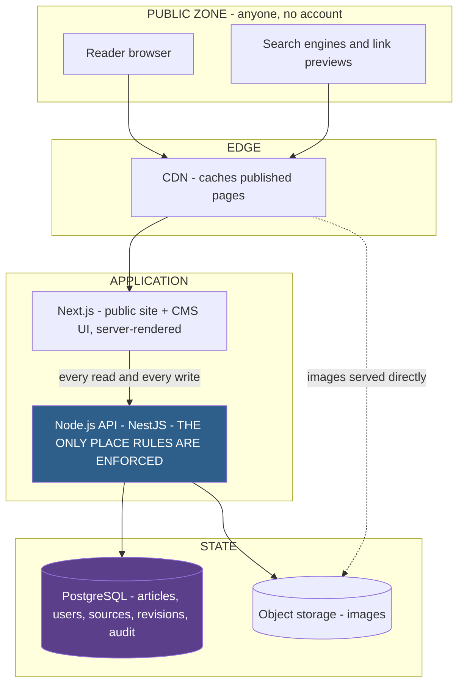

# 23 — Production Architecture Discovery

**Stage:** Phase 4A — technical architecture discovery (still pre-development)
**Last updated:** 2026-09-09
**Status:** Discovery only. Nothing here has been built, installed or configured.

---

## 0. How to read this document

Every recommendation carries one of four labels. This is the point of the
document: you should be able to tell at a glance whether something is forced by
your requirements or chosen by me.

| Label | Meaning |
|---|---|
| **[REQUIREMENT-DERIVED]** | Traces to a specific requirement, business rule or workflow in `docs/01-12`. If you change the requirement, the decision changes. Always cited by ID. |
| **[ARCHITECTURAL RECOMMENDATION]** | My engineering judgement. Defensible, but a competent engineer could choose differently. The reasoning is always given so you can disagree with it. |
| **[GENERAL ENGINEERING PRACTICE]** | Standard for any production web system. Not specific to this product. |
| **[OPEN PRODUCT DECISION]** | Blocked on a question only you can answer. Named with its `OQ-` or `P2-` reference. **Not silently filled in.** |

Labels from earlier phases keep their meanings: **[CONFIRMED] [PROPOSED]
[PROVISIONAL] [OPEN] [FUTURE]**.

**Nothing here changes a product requirement.** Where the documentation
contradicts itself, the contradiction is surfaced (§13.6), not resolved.

---

## 1. Executive summary

### 1.1 The recommendation in one paragraph

Build a **Next.js** front end and a **separate NestJS API** over **PostgreSQL**,
accessed through **Prisma**, with **session cookies** for authentication and
**capability-based guards** for authorisation. Store media in **S3-compatible
object storage**. Use **PostgreSQL full-text search**, not a search cluster. Cache
public pages at the **CDN and in Next.js**, invalidated on publish. Run **no
background workers in V1**. Deploy to a **managed platform** across three
environments. This is a deliberately small stack: one database, one API, one front
end, one object store, and nothing else until a measured need appears.

### 1.2 The three decisions that actually matter

Most of this document is detail. Three decisions carry the architecture.

**1 — A separate backend, not Next.js full-stack.**
Not for scale. At your expected volume Next.js alone would cope comfortably. The
reason is `BR-11` and `SEC-01`: *rules are enforced on the server; the interface
only reflects them*, checked *on every request*. A separate API gives you **one
place where the sixteen business rules live**, reachable only through a boundary
you control. If the public site could read the database directly, `BR-01`
(published only) would be enforced in two codebases — and two is how it gets
broken. **[REQUIREMENT-DERIVED — BR-11, SEC-01, SEC-02, PRF-07]**

**2 — State transitions are explicit operations, never a field you set.**
`BR-10` says any transition outside the table in `11` §4 is refused. That is an
architectural instruction, not a footnote. The API must expose `submit`,
`approve`, `publish`, `request-changes` and `reject` as distinct guarded
operations — never a generic "update the article's state" call. Each has its own
permitted actors, its own preconditions (`BR-07` comment, `BR-08` reason, `BR-09`
completeness) and its own audit record. A generic state field invites exactly the
bug this product cannot survive. **[REQUIREMENT-DERIVED — BR-10, BR-02, BR-05]**

**3 — Sessions, not JWTs.**
`SEC-05` requires that sessions *end when an account is deactivated* and that
*sign-out works everywhere*. A stateless token cannot be revoked. Meeting `SEC-05`
with JWTs means keeping a revocation list checked on every request — which is a
session store, built worse. **[REQUIREMENT-DERIVED — SEC-05]**

### 1.3 What this architecture deliberately excludes

No Kubernetes. No microservices. No message broker. No Elasticsearch. No GraphQL.
No Redis in V1. Each was considered and rejected against `01` §5.6 (*every
technology must justify itself*) and `SCL-07`, which places them out of scope
*until a measured need exists*. §21 gives the trigger for each.

### 1.4 The honest caveats

- ~~Nine 🔴 open questions block parts of the data model.~~ **Resolved 2026-09-09
  (Phase 4B-0):** `OQ-08`, `OQ-22`, `OQ-26` and `OQ-29` are answered, and the
  article/revision shape is settled in `26-data-model-decisions.md` §1 —
  **Article identity plus immutable revisions**, which is the shape §9.4
  anticipated. Five 🔴 questions remain open; none blocks the schema.
- ~~`BR-13` and `OQ-29` contradict each other on admin self-approval.~~
  **Resolved 2026-09-09 (Phase 4B-0): self-approval is forbidden.** §13.6.
- **`OQ-31` (expected scale) is unanswered.** Everything assumes the stated
  assumption in `02` §Q — tens of articles a day, low millions of monthly readers.
  If the real figure is far larger, §21 changes.
- **The backend recommendation has a real cost.** NestJS is the least familiar
  thing in this stack for a JavaScript developer. §7.3 states the exact condition
  under which I would switch to Fastify, so you can overrule it on evidence
  rather than taste.

---

## 2. Product-derived technical requirements

Extracted from `docs/01-12`. Nothing here is invented; every row cites its source.
Where the documentation does not settle something, the row says **OPEN QUESTION**
rather than guessing.

### 2.1 Public news website

| Product requirement | Technical requirement | Why it matters |
|---|---|---|
| `PUB-01` Homepage, latest first | Server-rendered list query ordered by publish time, paginated | `PRF-06` forbids unbounded lists; `SCL-01` says article count grows indefinitely |
| `PUB-02` Article page with full content | Server-rendered page containing the complete story in the delivered HTML | `SEO-01` — content assembled in the browser is invisible to crawlers and slow on phones |
| `PUB-03` Only `PUBLISHED` is reachable | State filter applied **in the data layer**, not the view layer | `BR-01`. A view-layer filter is bypassable; a data-layer one is the control |
| `PUB-04` Stable human-readable address | Immutable slug column, unique, fixed at publication | `BR-15` — the address is a public promise; `SEO-06` |
| `PUB-05` Category pages | Category entity with its own listing query and address segment | **OPEN QUESTION — `OQ-18`** whether categories exist at all; `OQ-20` whether they appear in the address |
| `PUB-06` Pagination | Keyset (cursor) pagination over published articles | `PRF-06`, `SCL-01`. Offset pagination degrades as the archive grows |
| `PUB-12` Correct "not found" | 404 for missing, unpublished and withdrawn alike | `SEC-03` — a different response for "exists but unpublished" leaks that a story exists |
| `PUB-13` Works on phones | Responsive rendering; no server-side device detection | `PRF-02` — device-varying HTML is far harder to cache |
| `SEO-08` Sitemap | Generated from published articles, regenerated on publish and withdraw | `SEO-14` — a withdrawn story must leave the sitemap |
| `SEO-13` RSS feed | Generated feed of published articles | `06` §2.1 places it in V1 |
| `PRF-02` Public pages cacheable | Anonymous public responses must not vary per user | The single largest performance lever available (§16) |
| `PRF-07` Back-office must not slow the public site | Separate cache and scaling path for public reads vs CMS writes | A busy newsroom must never degrade a story that is going viral |

### 2.2 Article creation, editing and revisions

| Product requirement | Technical requirement | Why it matters |
|---|---|---|
| `CAP-02`, `EDT-05` Save draft repeatedly | Idempotent update, no state change, no notification | `BR-03` — saving must never have a publication side effect |
| `EDT-04` Article fields | Headline, summary, body, category, image + alt + credit, sources, SEO title and description | `02` §L.1. **OPEN QUESTION — `OQ-22`**: body format decides storage type and the whole sanitisation surface |
| `EDT-06` Autosave | Frequent low-cost writes that overwrite freely, kept separate from revision snapshots | `OQ-26` explicitly separates autosave from version history |
| `EDT-12` Preview as a reader | Server-rendered preview using the public renderer, behind an authorisation check | `SEC-03`. **OPEN QUESTION — `P2-07`**: preview addressing is undefined and carries a real leak risk |
| `EDT-15` Attach images | Object-storage upload with server-side type and size validation | `SEC-10`, `SCL-06` |
| `CAP-16` Correct a published article without losing the record | The live version stays served while a new revision is reviewed | `BR-16`. **OPEN QUESTION — `OQ-08` / `P2-26`**: decides the core data shape (§9.4) |
| `SCL-04` Model accommodates later features | Tags, multiple authors and versions addable without redesign | Explicitly required; shapes the schema even though tags are `[FUTURE]` |

### 2.3 Editorial workflow — approval, changes, rejection, publication

| Product requirement | Technical requirement | Why it matters |
|---|---|---|
| `CAP-03` Submit for review | Guarded transition `T3`, precondition `BR-09` | Submission refused if headline, summary or body is missing |
| `CAP-05` Approve and publish | Guarded transitions `T5` then `T10`, admin capability only | `BR-02`. The most privileged operation in the product |
| `CAP-07` Request changes | Guarded transition `T4`, non-empty comment enforced server-side | `BR-07`. Client-side validation is a courtesy, not the rule |
| `CAP-06` Reject | Guarded transition `T6`, non-empty reason enforced server-side | `BR-08` |
| `CAP-08` Revise and resubmit | Guarded transition `T9`, same preconditions as the first submission | `11` §4 |
| `BR-05` Editors never publish | No capability, no route, and an active server-side refusal | `11` §5.1 requires forbidden moves be *actively refused and recorded*, not merely absent from the UI |
| `BR-06` Publication records who and when | Publishing admin and timestamp written in the same transaction as the state change | If the two can diverge, the record is unreliable exactly when it is needed |
| `BR-10` Only defined transitions | Whitelist state machine; everything else refused | Makes the invalid-transition table in `11` §5 executable |
| `CAP-17` Unpublish | Guarded transition `T12`, plus cache and sitemap invalidation | `SEO-14`. **OPEN QUESTION — `OQ-16`** what readers see afterwards |
| `P2-23` Two admins deciding at once | Optimistic concurrency check on every transition | The second decision must be cleanly refused, not silently applied to a story that has moved |
| `CAP-15` Every state change recorded | Append-only audit write inside the transition transaction | **OPEN QUESTION — `OQ-11`** scope; `SEC-11` requires it be uneditable |

### 2.4 Users, authentication, authorisation

| Product requirement | Technical requirement | Why it matters |
|---|---|---|
| `CAP-01` Private back-office | Authenticated session required for every CMS route and API call | `SEC-01` |
| `USR-01` No self-registration | Account creation is admin-only; invitation flow to set a password | **OPEN QUESTION — `OQ-27`** |
| `USR-03` Deactivate without deleting work | Soft-deactivation flag; articles and audit rows survive | `BR-12`; **OPEN QUESTION — `P2-20`** on a leaver's in-flight drafts |
| `USR-04` Passwords irreversibly hashed | Modern memory-hard hash | `SEC-04` |
| `USR-07`, `BR-14` Always one active admin | Server-side invariant that **refuses** demotion or deactivation of the last admin | `12` PG-ADM-07 requires refusal, not a warning |
| `SEC-05` Sessions expire and can be ended | Server-side session state, revocable immediately | Drives the session-vs-JWT decision (§11) |
| `SEC-09` Brute-force protection | Rate limiting on sign-in, by address and by account | Plus `P2-11`: one generic failure message for every cause |
| `USR-06`, `SEC-13` 2FA for publishers | TOTP second factor on publish-capable accounts | **OPEN QUESTION — `OQ-28`** whether V1 |
| `03` §4.5 Capability checks | Authorisation asks *may this user publish?*, never *is this an admin?* | An explicit product principle; makes a fourth role a config change rather than a hunt through the codebase |

### 2.5 Sources, categories, tags, media

| Product requirement | Technical requirement | Why it matters |
|---|---|---|
| `CAP-11`, `SRC-01` Manual sources | Source entity, staff-maintained, no ingestion of any kind | `01` §2.4 — a confirmed non-goal |
| `SRC-03/04` Reusable shared sources | Many-to-many between articles and sources | **OPEN QUESTION — `OQ-24`**: shared list, free text or both; and whether public |
| `SRC-05/06` Verification status; who may create | Fields and capabilities still to be defined | **OPEN QUESTION — `OQ-14`** |
| `ADM-10` Manage categories | Category entity, admin-managed | **OPEN QUESTION — `OQ-18`**; `P2-21` warns deletion can break published addresses |
| Tags | **`[FUTURE]`** — not built in V1 | `06` §2.4. Named only because `SCL-04` requires the model to accept them later without redesign |
| `EDT-15`, `OQ-21` Images | Object storage, mandatory alt text, credit field, type and size validation | `A11Y-03`, `SEO-12`, `SEC-10`, `SCL-06` |

### 2.6 Search, SEO, audit, errors, reliability

| Product requirement | Technical requirement | Why it matters |
|---|---|---|
| `PUB-10` Basic search | Full-text index over published articles only | **OPEN QUESTION — `OQ-19`** whether V1 at all. `06` says include *only if simple*; `P2-27` says exclude result pages from indexing |
| `SEO-01` Content in delivered HTML | Server rendering for every public page | The most important technical consequence of being a news site |
| `SEO-05` Structured data | `NewsArticle` JSON-LD built from stored article fields | Machine-readable headline, author and publish time |
| `SEO-10` Correct status codes | 404 for missing, 301 for permanently moved | Wrong codes keep dead addresses in the index |
| `ADM-14`, `CAP-15` Article history | Append-only audit log, queryable per article | **OPEN QUESTION — `OQ-11`**. Cannot be back-filled — history not recorded is gone forever |
| `SEC-11` Audit is uneditable | Enforced at the database privilege level, not only in application code | An audit trail the application can rewrite is not evidence |
| `12` §0 Error and empty states | Distinct handling for loading, empty, error, not-found, unauthorised, forbidden, validation and conflict | `P2-10`: "forbidden" must degrade to "not found" wherever it would reveal an unpublished story |
| `SEC-06` Standard attack classes | Injection, XSS, CSRF, insecure direct object access | `SEC-07` makes body sanitisation critical if rich text is chosen (`OQ-22`) |
| `OPS-01` Backups with tested restore | Automated backup plus a rehearsed restore | *An untested backup is a hope, not a backup* — `06` |
| `OPS-03` Deploy without downtime | Rolling deploy; migrations safe to run against a live system | A news site does not get a maintenance window |
| `SCL-02` A spike must not take the site down | CDN and cached pages absorbing the spike ahead of the application | The most likely real-world failure mode for a news platform |

### 2.7 Requirements this phase could not derive

Recorded so that no gap is filled silently.

| Area | Why it cannot be settled here |
|---|---|
| Body content format | `OQ-22` — decides storage type, editor component, rendering, and the entire XSS surface (`SEC-07`) |
| Article / revision shape | `OQ-08`, `OQ-26`, `P2-26` — decides whether state lives on the article or the revision (§9.4) |
| Byline vs account | `OQ-23` — decides whether `Author` is a separate entity from `User` |
| Sources model | `OQ-24` — shared list, free text or both; public or internal |
| Categories | `OQ-18`, `OQ-20` — whether they exist, and whether they appear in public addresses |
| Audit scope | `OQ-11` — article transitions only, or user and configuration changes too |
| Performance targets | `OQ-30` — "fast" cannot be tested without a number |
| Expected scale | `OQ-31` — 🔴 blocking; every sizing statement in §21 rests on the stated assumption |

---

## 3. System boundary

### 3.1 Components, and whether each is actually needed

| Component | Classification | Justification |
|---|---|---|
| **Public front end** (Next.js) | **REQUIRED V1** | `PUB-01/02/13`, `SEO-01`. There is no product without it |
| **CMS front end** (same Next.js app, separate route group) | **REQUIRED V1** | `CAP-01`, `EDT-*`, `ADM-*`. One app, not two — see §4.3 |
| **Node.js API** (NestJS) | **REQUIRED V1** | `BR-11`, `SEC-01` — one place where the rules live |
| **PostgreSQL** | **REQUIRED V1** | Relational, transactional data with a mandatory audit trail (§9) |
| **Object storage** (S3-compatible) | **REQUIRED V1** | `EDT-15`, `SCL-06` — media must not live on one machine's disk |
| **CDN** | **REQUIRED V1** | `SCL-02`, `PRF-01/02`. The cheapest protection against a traffic spike |
| **Next.js route cache / ISR** | **REQUIRED V1** | `PRF-02/03`. Built in; costs nothing extra to operate |
| **Error tracking** | **REQUIRED V1** | `OPS-02`. *You will otherwise learn about outages from readers* |
| **Automated backups** | **REQUIRED V1** | `OPS-01` |
| **Staging environment** | **REQUIRED V1** | `OPS-04` |
| **Full-text search (inside PostgreSQL)** | **OPTIONAL V1** | Conditional on `OQ-19`. Not a new component — a column and an index |
| **Redis** | **OPTIONAL / FUTURE** | Not needed at one API instance. Triggers in §16.5 |
| **Background worker + queue** | **FUTURE** | Nothing in V1 requires one (§17). Scheduling (`OQ-07`) is what forces it |
| **Dedicated search engine** | **FUTURE** | `SCL-07`, `06` §2.4. Out of scope until measured |
| **Message broker / microservices / Kubernetes** | **NOT PLANNED** | `SCL-07` names these as deliberately out of scope |

### 3.2 The boundary drawn



**The rule this diagram encodes:** Next.js never touches PostgreSQL. Every read
and every write goes through the API, so `BR-01` is enforced once, in one place.
**[REQUIREMENT-DERIVED — BR-11, SEC-01]**

### 3.3 Trust zones

| Zone | Who reaches it | What it may see |
|---|---|---|
| **Public** | Anyone, unauthenticated | `PUBLISHED` articles only — `BR-01` |
| **Staff** | Authenticated editor | Own articles in any state — `OQ-05` may narrow this further |
| **Admin** | Authenticated admin | Everything; the only zone that can publish |
| **Internal** | The API process only | Database and object-store credentials — `SEC-12` |

**[REQUIREMENT-DERIVED — `03` §3, SEC-03]** The public zone must not be able to
detect the existence of anything in the other three. A wrong address, an
unpublished story and a withdrawn story produce identical responses.

---

## 4. Frontend architecture

### 4.1 Why Next.js

**[REQUIREMENT-DERIVED — SEO-01, PRF-01, PRF-02, PUB-13]**

`SEO-01` is the deciding requirement: *article content is present in the HTML the
server sends, not assembled later in the browser*. That single line eliminates
every client-only framework. Next.js additionally gives, without extra
infrastructure: incremental static regeneration (`PRF-02`, `PRF-03`), image
optimisation (`PRF-04`), a metadata API (`SEO-03`, `SEO-04`, `SEO-07`), and
file-based generation of `sitemap.xml` and `robots.txt` (`SEO-08`, `SEO-09`).

This is also the developer-familiarity choice: it is JavaScript/React, and it is
the mainstream way to build a server-rendered news site.

### 4.2 What runs where, and why

| Surface | Rendering | Runs on | Why |
|---|---|---|---|
| Homepage `PG-PUB-01` | Static, revalidated on publish | Server | `PRF-02` — identical for everyone; `SEO-01` |
| Article page `PG-PUB-03` | Static, revalidated on publish/correction | Server | The most-cached page in the product. `SEO-01`, `SEO-05` |
| Section page `PG-PUB-02` | Static, revalidated on publish | Server | Same profile as the homepage |
| Search results `PG-PUB-04` | Server-rendered per request, **not** cached | Server | Query-dependent; `P2-27` says exclude from indexing |
| Static pages `PG-PUB-05..08` | Static | Server | Change rarely. `P2-29` keeps them build-time in V1 |
| 404 / error `PG-PUB-09/10` | Static | Server | `SEO-10` requires the correct status code |
| `sitemap.xml`, `rss`, `robots.txt` | Generated, revalidated on publish | Server | `SEO-08`, `SEO-13`, `SEO-14` |
| Sign-in `PG-EDT-01` | Server shell, small client form | Both | Credentials posted to the server; never held in client state |
| CMS dashboards and lists | Server-rendered per request | Server | Always fresh, never cached, per-user. `PRF-09` |
| **Article editor `PG-EDT-07`** | **Client component** | Browser | Genuinely interactive: autosave, dirty tracking, validation, unsaved-changes warning |
| Article preview `PG-EDT-08` | Server-rendered with the public renderer | Server | Must look exactly like the public page, behind an auth check (`SEC-03`) |

**The principle:** *the public site ships as little JavaScript as possible; the
CMS ships as much as it needs.* This matches `18` §1 trait 4 (**Immediate** —
"no skeleton loaders on the public site") and `PRF-05` (the reader downloads only
what the page needs). **[ARCHITECTURAL RECOMMENDATION]**

### 4.3 One Next.js application, not two

**[ARCHITECTURAL RECOMMENDATION]** The public site and the CMS live in one Next.js
project, separated by route groups (`/` public, `/staff` CMS). Reasons:

- `19` is explicitly *one system, three densities* — shared design tokens and
  components argue for one codebase.
- The preview screen (`PG-EDT-08`) must render with **the public renderer**. Two
  projects means duplicating that renderer, and a preview that drifts from the
  live page is worse than no preview.
- `P2-04` already establishes one sign-in page shared by both roles.

**The risk this creates, and the mitigation:** one app means one bundle boundary
to get wrong. Mitigation: `/staff` is excluded from `robots.txt` (`SEO-09`),
protected by middleware, and — critically — **the separation that matters is
enforced in the API, not the front end** (`SEC-02`).

### 4.4 Data fetching, forms and validation

| Concern | Approach | Rationale |
|---|---|---|
| Public reads | Server components call the API during render/revalidation | Keeps the API the single source of rules; the result is cached so the hop is rare |
| CMS reads | Server components call the API per request with the session cookie forwarded | Always fresh; no stale editorial data |
| CMS writes | Posted to a Next.js server action or route handler, which calls the API | Keeps the session cookie httpOnly and first-party (§11.4) |
| Validation | Schema defined once, shared shape, **enforced again in the API** | `SEC-02` — front-end validation is a courtesy. `BR-07`/`BR-08`/`BR-09` are enforced server-side |
| Loading states | Route-level streaming in the CMS; **none on public pages** | `12` §0 — public pages arrive complete |
| Error states | Error boundaries mapping API failures to the vocabulary in `12` §0 | Never leak technical detail (`SEC-06`) |
| Images | Next.js image optimisation over object-storage originals | `PRF-04`, `PRF-08` — reserved space prevents layout shift |

**[OPEN PRODUCT DECISION — `OQ-22`]** The body editor component cannot be chosen
until the body format is decided. Plain text, limited rich text, structured
blocks and Markdown imply four different editors and four different rendering and
sanitisation paths.

---

## 5. Backend architecture

### 5.1 Responsibility

The API is the **only** component that may:

- read or write the database;
- decide whether an action is permitted (`SEC-01`);
- perform a state transition (`BR-10`);
- write to the audit log (`CAP-15`, `SEC-11`);
- issue or revoke a session (`SEC-05`).

**[REQUIREMENT-DERIVED — BR-11, SEC-01, SEC-02]**

### 5.2 Internal layering

**[GENERAL ENGINEERING PRACTICE]**, shaped by this product's needs:

```
HTTP boundary        Controller     — routing, shape validation, status codes
Policy               Guard          — authenticated? capability? ownership?
Domain               Service        — the state machine and the business rules
Persistence          Repository     — database access, transactions
                     Database       — constraints as the last line of defence
```

**Why the guard is its own layer rather than a line inside each controller:**
`SEC-01` requires the check *on every request*. A check that must be remembered
will eventually be forgotten on exactly one route, and that route is the
vulnerability. A guard applied at module or controller scope is applied by
construction. This is the single strongest argument in the framework comparison
that follows.

### 5.3 The transition service

**[REQUIREMENT-DERIVED — BR-10, BR-06, CAP-15, P2-23]** Every workflow action goes
through one component that, in a single database transaction:

1. loads the article and its current state;
2. checks the caller's capability for that specific transition;
3. checks the transition is legal from the current state (`11` §4);
4. checks the transition's preconditions (`BR-07`, `BR-08`, `BR-09`);
5. checks the caller's expected version matches (optimistic concurrency, `P2-23`);
6. writes the new state;
7. writes a revision snapshot where required (`OQ-26`);
8. writes the audit record (`BR-06`, `CAP-15`);
9. commits — or rolls the whole thing back.

Steps 6, 7 and 8 must not be separable. If publication can succeed while its audit
record fails, the record is unreliable exactly when someone is asking who
published a disputed story.

---

## 6. Node.js framework comparison

Assessed against this product, not in the abstract. The weighting comes from what
the documentation prizes: `BR-11`/`SEC-01` (rules enforced server-side, every
request), the sixteen business rules that need tests (`02` §M), a developer
comfortable with JavaScript, and possible team growth (`SCL-03`).

### 6.1 Express

| Aspect | Assessment |
|---|---|
| **Architecture** | Minimal, unopinionated middleware chain |
| **Organisation** | Entirely up to you. No prescribed structure |
| **Strengths** | Smallest concept count; vast ecosystem; almost any Node developer can read it; fastest possible start |
| **Weaknesses** | Cross-cutting concerns are hand-rolled and applied by memory. Nothing stops one route missing its auth middleware — the exact failure mode `SEC-01` exists to prevent. No built-in validation, DI or testing structure |
| **Learning curve** | Lowest |
| **Performance** | Adequate; slower than Fastify, irrelevant at this scale |
| **Testing** | Works with supertest, but service-level testing needs structure you must invent |
| **Validation** | None built in; add a library and remember to apply it |
| **Auth / authz** | Middleware; correctness depends on discipline |
| **Scalability** | Fine horizontally |
| **Maintainability** | Degrades as the team grows — every codebase looks different |
| **Dev speed** | Fastest at first, slows as conventions have to be invented |

### 6.2 Fastify

| Aspect | Assessment |
|---|---|
| **Architecture** | Plugin-based with real encapsulation; hooks for cross-cutting concerns |
| **Organisation** | Plugins give natural boundaries; layering still your decision |
| **Strengths** | Schema-first validation and serialisation built in — a large part of `SEC-06` input validation becomes declarative. Encapsulated plugins let auth be registered over a whole route group at once. Excellent testing via `inject()`. Fast |
| **Weaknesses** | Less prescriptive about services and repositories; two developers will still organise domain logic differently. Smaller convention ecosystem than Nest |
| **Learning curve** | Low-moderate; plugin encapsulation is the one genuinely new idea |
| **Performance** | Best of the four |
| **Testing** | Very good — no network needed |
| **Validation** | Best-in-class, built in |
| **Auth / authz** | `preHandler` hooks at plugin scope — structurally applied, which satisfies `SEC-01` well |
| **Scalability** | Excellent |
| **Maintainability** | Good, with conventions you impose and document |
| **Dev speed** | Fast, and stays fast |

### 6.3 NestJS

| Aspect | Assessment |
|---|---|
| **Architecture** | Opinionated modular framework: modules, controllers, providers, dependency injection |
| **Organisation** | Prescribed. One obvious place for each kind of code |
| **Strengths** | **Guards** are exactly the abstraction `SEC-01` describes — a permission check applied structurally at controller or module scope, not remembered per route. **Pipes** validate every input by construction. DI makes the transition service trivially testable in isolation, which matters because `BR-01`-`BR-16` need tests (`02` §M). Conventions survive team growth (`SCL-03`). Runs on a Fastify adapter, so its performance ceiling is Fastify's |
| **Weaknesses** | Heaviest concept load: modules, providers, DI, decorators, and TypeScript throughout. Most boilerplate. Genuinely more to learn for a developer whose background is plain JavaScript |
| **Learning curve** | **Highest of the four — the main cost of this recommendation** |
| **Performance** | Fine; with the Fastify adapter, very good |
| **Testing** | Best of the four — a first-class testing module, DI makes mocking natural |
| **Validation** | Built-in pipes plus class-validator/Zod |
| **Auth / authz** | The strongest story: guards compose, are declarative, and are hard to omit accidentally |
| **Scalability** | Excellent |
| **Maintainability** | Best of the four for a codebase expected to outlive its first author |
| **Dev speed** | Slowest to start, fastest once the structure is internalised |

### 6.4 Next.js as the backend (no separate API)

| Aspect | Assessment |
|---|---|
| **Architecture** | Route handlers and server actions inside the front-end app |
| **Organisation** | Colocated with UI |
| **Strengths** | Fewest moving parts; one deploy, one language, one repo; fastest possible V1; no cross-origin or cookie complexity |
| **Weaknesses** | **The security boundary becomes a convention rather than a wall.** Server and client code sit in the same tree, and "this must only run on the server" is enforced by discipline and a build-time boundary rather than by a network hop. For a product whose central risk is an unpublished story leaking or an editor publishing, that is the wrong trade. Also couples public-read scaling to CMS activity, working against `PRF-07` |
| **Learning curve** | Lowest overall — it is the same skill as the front end |
| **Performance** | Good; public pages are cached anyway |
| **Testing** | Weakest — business rules end up entangled with framework request objects, making `BR-01`-`BR-16` harder to test in isolation |
| **Validation** | Whatever you add |
| **Auth / authz** | Workable, but checks live next to UI code and are easy to omit on a new handler |
| **Scalability** | Ties front-end and back-end scaling together |
| **Maintainability** | Fine at small scale; blurs as the domain grows |
| **Dev speed** | Fastest |

### 6.5 Comparison summary

Weighted for this product. **5 = strongest.**

| Criterion | Express | Fastify | NestJS | Next.js full-stack |
|---|:--:|:--:|:--:|:--:|
| Structural enforcement of `SEC-01` | 2 | 4 | **5** | 2 |
| Testability of `BR-01`-`BR-16` | 3 | 4 | **5** | 2 |
| Input validation built in (`SEC-06`) | 1 | **5** | **5** | 2 |
| Developer familiarity (JS background) | **5** | 4 | 2 | **5** |
| Development speed to V1 | 4 | 4 | 3 | **5** |
| Maintainability as the team grows | 2 | 4 | **5** | 2 |
| Separation of public reads from CMS (`PRF-07`) | 4 | 4 | 4 | 1 |
| Deployment simplicity | 4 | 4 | 4 | **5** |
| Performance headroom | 3 | **5** | 4 | 3 |
| **Total** | **28** | **38** | **37** | **27** |

**Read this table carefully, because the totals mislead.** Fastify and NestJS are
within one point, and Express and Next.js are not close on the criteria that
matter most here. The choice is genuinely between Fastify and NestJS, and §7
explains why the tie is broken the way it is.

---

## 7. Recommended backend framework

### 7.1 Recommendation: NestJS — **SUPERSEDED 2026-09-09 (Phase 4C-1)**

> **RESOLUTION.** The client chose **Express**, on plain Node.js, over this
> recommendation — developer familiarity with Express specifically, not just
> Node.js in general (§7.2's premise). `AD-03` in §28 is updated accordingly.
> The guard/DI structure NestJS would have supplied by construction is now
> hand-written: capability checks as ordinary Express middleware
> (`requireCapability`, applied per-router — see `backend/src/common/
> middleware/`), applied globally except for an explicit public-route
> allowlist registered before the auth middleware, so the same "deny by
> default" posture (`SEC-01`) holds without a decorator/metadata system. The
> cost named in §7.2 — a missing check being the easiest mistake to make —
> is therefore now a discipline the code review process must catch, not
> something the framework prevents structurally. The analysis below is
> retained as the record of how the original recommendation was reached.

**[ARCHITECTURAL RECOMMENDATION]** — with the switch condition in §7.3.

### 7.2 Why, given that the developer already knows Node.js

The developer's JavaScript familiarity is a real asset, but it is worth being
precise about what it buys. All four options are Node.js; none requires learning a
new language or runtime. What differs is how much *structure* the framework
supplies — and structure is exactly what this product needs more of than most.

This is an unusual project: **modest in feature count, disproportionate in
correctness requirements.** Roughly 36 pages, 11 entities, 7 states and 17
transitions — small. But `02` §M lists sixteen rules that *must never be
violated, no matter which screen or path is used*, and `11` §5.1 requires
forbidden moves be **actively refused and recorded**, not merely absent from the
interface. The cost of one missed check is not a bug report; it is an unpublished
story becoming public, or an editor publishing.

Three properties follow, and NestJS supplies all three by construction:

1. **A permission check that cannot be forgotten.** `SEC-01` asks for a check on
   *every request*. A Nest guard applied at controller or module scope covers
   every route in that scope, including routes added next year by someone who has
   not read this document. In Express it is a line you must remember; in Fastify a
   hook you must register on the right plugin.

2. **Business rules testable away from HTTP.** `02` §M makes tests the definition
   of done for `BR-01`-`BR-16`. Dependency injection lets the transition service
   be tested directly, with a fake repository, without spinning up a server. That
   turns "an editor cannot publish" into a fast unit test rather than an
   integration test nobody runs.

3. **Conventions that survive the author leaving.** `SCL-03` anticipates the
   newsroom growing. Nest's prescribed structure means a second developer knows
   where the article service lives without being told.

**What this recommendation costs, stated plainly:** NestJS is the least familiar
technology in this stack. Decorators, dependency injection and modules are a new
paradigm for a developer coming from plain JavaScript, and TypeScript is
effectively mandatory. Expect a **genuine slowdown for the first two to three
weeks.** That cost is real and I am not discounting it — I am arguing it is repaid
because the thing being protected is the product's entire integrity.

### 7.3 The condition under which I would choose Fastify instead

**[ARCHITECTURAL RECOMMENDATION]** Switch to **Fastify** if either is true:

- **the developer has not used TypeScript in earnest**, or
- **V1 must ship in under roughly eight weeks with one developer.**

Under either condition the learning curve stops being an investment and becomes
the project's largest delivery risk. Fastify then gives most of what matters —
schema validation by construction, `preHandler` auth at plugin scope, excellent
testing — at a fraction of the conceptual cost, and it scored *higher* on the raw
totals in §6.5.

This is a real fork, not a formality. **Answer it before Phase 4B**, because it
changes the project's structure from day one. It is recorded as `AD-03` in §28.

### 7.4 Why not Express, and why not Next.js full-stack

**Express** is rejected not on capability but on structure: it makes the one
mistake this product cannot afford — a missing authorisation check — the easiest
mistake to make. Everything Express would need to be safe here is something Nest
or Fastify already provides.

**Next.js full-stack** is rejected reluctantly, because it is genuinely the
fastest path to a working V1 and the best fit for the developer's existing skills.
It loses on one point that outweighs the rest: it makes the boundary between "code
that enforces rules" and "code that draws buttons" a matter of convention rather
than architecture. `01` §5.3 states the principle as *trust the server, never the
screen* — that is much easier to hold when the server is a separate deployable
that the browser cannot reach except through a defined API.

**Note on the recommended runtime:** run NestJS on its **Fastify adapter** rather
than the default Express adapter. Same programming model, better throughput, and
Fastify's schema handling underneath. **[GENERAL ENGINEERING PRACTICE]**

---

## 8. API architecture

### 8.1 REST, not GraphQL

**[ARCHITECTURAL RECOMMENDATION]**

| Consideration | REST | GraphQL |
|---|---|---|
| Number of clients | One (Next.js, two surfaces) | Advantage only with many diverse clients |
| Data shapes | Stable and known from `12` | Advantage when clients need varying shapes |
| Authorisation | Per endpoint — easy to audit, matches `SEC-01` | Per field, per resolver — far more surface to secure |
| Caching | HTTP caching works naturally | Needs bespoke work |
| Query cost control | Bounded by endpoint | Needs depth and complexity limiting |
| Developer familiarity | High | Additional learning |

REST wins decisively. `06` explicitly rejects a public API (`no confirmed
consumer`), so the only consumer is your own front end. GraphQL's benefits are
consumer-diversity benefits you do not have, and its costs are authorisation costs
you cannot afford. **This is the simplest architecture that satisfies the actual
requirements**, which is what the brief asked for.

### 8.2 The critical shape decision: actions, not state fields

**[REQUIREMENT-DERIVED — BR-10, BR-02, BR-05, BR-07, BR-08]** Resources are
addressed conventionally, but **workflow transitions are exposed as named actions,
never as an editable `state` field.**

The reason is `BR-10`: anything not in the transition table is refused. If the API
accepted "set this article's state to `PUBLISHED`", then every caller, every
permission bug and every malformed request becomes a potential publication. If it
instead exposes an explicit *publish* operation, that operation carries its own
capability check, its own preconditions and its own audit write, and there is
exactly one code path to review, test and reason about.

This one decision converts `11` §5's table of forbidden moves from prose into
something the system structurally cannot do.

### 8.3 API domains and their responsibilities

No endpoints are designed here — that is Phase 4B. These are responsibilities.

| Domain | Responsibility | Key rules it owns |
|---|---|---|
| **AUTH** | Sign in, sign out, session lifecycle, password reset, invitation acceptance, 2FA if adopted | `SEC-04`, `SEC-05`, `SEC-09`, `P2-11` (uniform failure message), `OQ-28` |
| **ARTICLES** | Create, read, update content, list and filter. **Owns no transitions** | `BR-03` (saving is never publication), `BR-09` completeness checks, ownership scoping |
| **ARTICLE REVISIONS** | Snapshots at transitions; what changed since last submission; the correction working-copy | `OQ-26`, `OQ-08`, `P2-16`, `P2-26` |
| **REVIEWS** | The workflow transitions themselves: submit, withdraw, approve, publish, request changes, reject, unpublish, archive, restore. **The most security-sensitive domain in the product** | `BR-02`, `BR-05`, `BR-06`, `BR-07`, `BR-08`, `BR-10`, `P2-23` |
| **USERS** | Staff accounts, roles, invitation, deactivation, own profile | `USR-01`, `USR-03`, `BR-14` (refuse removing the last admin), `OQ-23` byline handling |
| **SOURCES** | The shared source list and its attachment to articles | `SRC-01`-`SRC-07`, `OQ-14`, `OQ-24`, `P2-30` (editors reach sources through the picker, not the management page) |
| **CATEGORIES** | Sections of the site | `OQ-18`; `P2-21` — refuse deleting a category with published articles |
| **TAGS** | **[FUTURE]** — not implemented in V1 | Named only so `SCL-04` is satisfied by the schema |
| **MEDIA** | Upload, validation, derivative generation, attachment, replacement, deletion | `SEC-10`, `A11Y-03` (alt text mandatory), `SCL-06` |
| **SEARCH** | Keyword search over published articles only | `OQ-19`; must never return unpublished content (`BR-01`) |
| **ADMIN** | Newsroom-wide views: review queue, all articles, dashboard aggregates | `ADM-02`, `ADM-07`, `ADM-08`, `P2-06` |
| **AUDIT** | Append-only record; per-article history | `CAP-15`, `SEC-11`, `OQ-11`. **Write-and-read only — no update or delete path exists at any layer** |

**Note the deliberate split between ARTICLES and REVIEWS.** Content editing and
workflow transitions are different domains with different authorisation rules.
Keeping them apart means the code that changes a headline can never accidentally
be the code that publishes.

### 8.4 Cross-cutting API conventions

**[GENERAL ENGINEERING PRACTICE]** unless noted.

- Every mutating request validated against a schema before reaching domain logic.
- Every response a defined shape; no accidental leaking of internal fields.
- **404 rather than 403** wherever a 403 would confirm an unpublished story exists
  — **[REQUIREMENT-DERIVED — SEC-03, P2-10]**. Inside the back-office, a plain
  403 is correct.
- Every error mapped to the vocabulary in `12` §0; never a raw stack trace
  (`SEC-06`).
- Correlation ID on every request, carried into logs (§23).
- Optimistic concurrency version on every transition (`P2-23`).

### 8.5 Request flows

**Flow 1 — Editor signs in** (`PG-EDT-01`, `SEC-04`, `SEC-05`, `SEC-09`, `P2-11`)

```
Browser -> Next.js (server action)
  -> API /auth/sign-in
     -> rate-limit check by address and account (SEC-09)
     -> look up user; verify password hash (SEC-04)
     -> if invalid: ONE generic message, whatever the cause (P2-11)
     -> if valid: create server-side session record
     -> set httpOnly, Secure, SameSite cookie
  -> Next.js reads role, redirects: editor -> dashboard, admin -> admin dashboard
```

The role decides the destination — the same door, two rooms (`07` Part 3).

**Flow 2 — Editor creates an article** (`CAP-02`, `EDT-03`)

```
Editor clicks "Write a new article"
  -> Next.js CMS opens the editor UI, empty
  -> NOTHING is created yet (09 section 3: the story exists from the first save,
     not from the page opening, so abandoned clicks leave no empty stories)
```

**Flow 3 — Editor saves a draft** (`CAP-02`, `EDT-05`, `BR-03`)

```
Editor -> Next.js -> API (create or update article)
  -> authenticate session
  -> authorise: may this user write THIS article? (owner or admin)
  -> validate field shapes
  -> write content; state stays DRAFT
  -> NO transition, NO audit-worthy event, NO notification (BR-03)
  -> respond -> "Saved" indicator
```

**Flow 4 — Editor submits for review** (`CAP-03`, `T3`, `BR-09`, `BR-04`)

```
Editor -> Next.js -> API /articles/{id}/submit
  -> authenticate
  -> capability: may this user submit? (owner or admin)
  -> transition legal from DRAFT? (BR-10)
  -> precondition: headline, summary, body all present? (BR-09)
     -> if not: refuse, stay DRAFT, say exactly what is missing
  -> version check (P2-23)
  -> BEGIN TRANSACTION
       state -> IN_REVIEW
       revision snapshot (OQ-26)
       audit: "submitted by X at T"
     COMMIT
  -> in-app indicator for admins (OQ-25)
  -> nothing is public (BR-04)
```

**Flow 5 — Admin opens the review queue** (`ADM-02`, `PG-ADM-02`)

```
Admin -> Next.js -> API /admin/review-queue
  -> authenticate
  -> capability: may this user review? (admin only)
  -> query articles WHERE state = IN_REVIEW, oldest first
  -> include waiting time (10 section 2: the most useful number on the page)
  -> render as a server-rendered table, uncached
```

**Flow 6 — Admin reviews an article** (`ADM-03`, `PG-ADM-03`)

```
Admin -> API /articles/{id} (full, including unpublished content)
  -> capability: may this user view any article? (admin)
  -> returns story, author, sources, previous feedback,
     and what changed since last submission (OQ-26 dependent)
  -> rendered with the PUBLIC renderer, so the admin reads what a reader would
```

**Flow 7 — Admin requests changes** (`CAP-07`, `T4`, `BR-07`)

```
Admin -> API /articles/{id}/request-changes  { comment }
  -> capability: admin
  -> transition legal from IN_REVIEW?
  -> comment non-empty? -> if empty, REFUSED server-side (BR-07)
  -> version check
  -> TRANSACTION: state -> CHANGES_REQUESTED
                  store comment WITH the article (09 section 5)
                  audit entry
  -> editor sees it flagged first on their dashboard (09 section 0)
```

**Flow 8 — Editor modifies after changes requested** (`T8`, `EDT-09`, `EDT-10`)

```
Editor opens article -> admin's comment is shown WITH the story, not in an inbox
  -> edits -> saves -> state stays CHANGES_REQUESTED
  -> earlier rounds of feedback remain visible (OQ-25)
```

**Flow 9 — Editor resubmits** (`CAP-08`, `T9`)

```
Same guards and preconditions as Flow 4 (BR-09 re-checked)
  -> state -> IN_REVIEW, new revision snapshot, audit entry
  -> back into the queue
```

**Flow 10 — Admin approves and publishes** (`CAP-05`, `T5`+`T10`, `BR-02`, `BR-06`)

```
Admin -> API /articles/{id}/approve-and-publish
  -> capability: may this user PUBLISH? (admin only - BR-02, BR-05)
  -> BR-13 self-approval check: actor must NOT be the author/last reviser
  -> transition legal from IN_REVIEW?
  -> version check (P2-23)
  -> BEGIN TRANSACTION
       state -> APPROVED  (passed through instantly in V1 - P2-24)
       state -> PUBLISHED
       fix slug permanently (BR-15)
       record publishing admin + timestamp (BR-06)
       revision snapshot
       audit entry
     COMMIT
  -> AFTER COMMIT: revalidate article page, homepage, section page,
     sitemap and RSS (PRF-03, SEO-08, SEO-14)
  -> editor notified
```

Cache invalidation happens **after** the commit, never inside the transaction. If
it happened inside, a slow cache call could roll back a publication.

**Flow 11 — Reader opens a published article** (`PUB-02`, `BR-01`, `SEO-01`)

```
Reader -> CDN
  -> HIT: HTML served from the edge. The API and database are never touched.
          This is what absorbs a traffic spike (SCL-02)
  -> MISS: CDN -> Next.js -> API /public/articles/{slug}
             -> NO authentication (public)
             -> query WHERE slug = ? AND state = PUBLISHED   <-- BR-01
             -> not found, or not published -> identical 404 (SEC-03)
          -> Next.js renders full HTML with metadata and JSON-LD
          -> cached at the edge for subsequent readers
```

---

## 9. Database architecture

### 9.1 Relational, not document

**[REQUIREMENT-DERIVED]** PostgreSQL. The reasoning:

| Factor | Evidence |
|---|---|
| The data is genuinely relational | Articles relate to users, categories, sources, revisions and audit entries. `SRC-04` wants sources *reusable across articles* — a join table, not embedded copies |
| Transitions must be atomic | §5.3 — state, revision and audit must commit together or not at all. Multi-document atomicity is where document stores are weakest |
| Constraints are a safety net | Unique slug (`BR-15`), foreign keys, check constraints. `BR-10` is enforced in code but the database can refuse impossible rows |
| The audit trail must be uneditable | `SEC-11`. Table-level privileges make this enforceable *outside* the application |
| Search without new infrastructure | Built-in full-text search covers `OQ-19` (§15) |
| `BR-14` needs a real invariant | "At least one active admin" is a constraint over a set of rows |

A document database would suit a content model that is mostly self-contained
documents with few relationships. That is not this product: the workflow, the
audit trail and the shared source list are all relational by nature.

### 9.2 Candidate entities

**Not a final schema.** Candidates derived from the documentation, with what is
settled and what is not.

| Entity | Purpose | Relationships | Lifecycle | Constraints |
|---|---|---|---|---|
| **User** | Someone who can sign in | Owns articles; performs audit events | Invited, active, deactivated — never deleted (`USR-03`, `BR-12`) | Unique email; at least one active admin (`BR-14`); one role (`USR-02`) |
| **Role / Capability** | What a user may do | User has one role; role grants capabilities | Fixed set in V1 | `03` §4.5 — check capabilities, not role names |
| **Article** | The story's stable identity | Author, category, sources, revisions, audit | Created, worked on, published, possibly withdrawn | Slug unique and immutable after publication (`BR-15`) |
| **ArticleRevision** | A snapshot of content | Belongs to an article | Created at transitions (`OQ-26`) | **Shape blocked on `OQ-08`/`P2-26` — see §9.4** |
| **Review** | One decision by one admin | Article, admin, resulting state | Created at a transition, never edited | Non-empty comment (`BR-07`) / reason (`BR-08`) |
| **Source** | Where information came from | Many-to-many with articles | Created, edited, possibly retired | **`OQ-14`, `OQ-24`** govern verification status and public visibility |
| **Category** | A section of the site | Articles belong to one | Created, renamed, deactivated | `P2-21` — refuse deletion when published articles reference it |
| **Tag** | **[FUTURE]** | Would be many-to-many | Not built | Named only to satisfy `SCL-04` |
| **Media** | An uploaded image | Attached to an article | Uploaded, attached, replaced, soft-deleted | Alt text mandatory (`A11Y-03`); type and size validated (`SEC-10`) |
| **AuditLog** | Who did what, when | References user and article | **Append-only. Never updated, never deleted** | `SEC-11` enforced by database privileges |
| **Session** | An active sign-in | Belongs to a user | Created at sign-in; destroyed on sign-out, expiry or deactivation | `SEC-05` — must be revocable |

### 9.3 Two entities that are not obvious but are needed

**Session as a table.** Follows directly from `SEC-05` (§11). It also gives
"sign out everywhere" and immediate revocation on deactivation for free.

**Capability as a concept, even with three roles.** `03` §4.5 is explicit: ask
*may this user publish?*, not *is this user an admin?*. In V1 the mapping is
trivial, but writing checks this way is what makes `OQ-10` (a future Senior
Editor role) a configuration change rather than a hunt through the codebase.

### 9.4 The blocking modelling question

**[OPEN PRODUCT DECISION — `OQ-08`, `OQ-26`, `P2-26`]**

`11` §8 and `BR-16` require that when a published story is corrected, **the live
version stays served, untouched, while the correction goes through review.** A
story can therefore be *published* **and** *have a correction in review* at the
same time.

That single sentence decides the shape of the most important table in the system:

- **If state lives on the Article**, a story can only be in one state, and the
  correction model is impossible without a second record.
- **If state lives on the ArticleRevision**, an Article becomes a stable identity
  (id, slug, author) with many revisions, one of which is *the published one* and
  another of which may be *in review*. The correction model works naturally, and
  `OQ-26`'s revision snapshots come almost free.

**[ARCHITECTURAL RECOMMENDATION]** The second shape is very likely correct, and it
is what `P2-26` gestures at ("model the live version and the working revision as
separate records"). **But it must not be assumed.** It depends on `OQ-08` (are
published articles editable, and how) and `OQ-26` (are revisions kept at all). If
`OQ-26` comes back as *(a) no history*, the second shape is over-built; if `OQ-08`
comes back as *(a) edit live*, the whole correction model disappears and with it
the reason for the shape.

**This is the single most expensive thing in this document to get wrong**, because
it is the hardest to change after data exists. `05` already marks both questions
🔴 blocking. They are blocking for exactly this reason.

### 9.5 Indexing and data-layer notes

**[GENERAL ENGINEERING PRACTICE]**

- Index the public read path first: `(state, published_at DESC)` for the homepage
  and feeds, `slug` unique for article lookup, `(category_id, state, published_at)`
  for section pages.
- Index the review queue: `(state, submitted_at)`.
- Full-text index only over published content (§15).
- Keyset pagination throughout (`PRF-06`, `SCL-01`).
- Store timestamps in UTC; render in the publication's timezone —
  **[OPEN PRODUCT DECISION — `OQ-42`, `P2-28`]**.

---

## 10. ORM and data access

### 10.1 Comparison

| Approach | Type safety | Migrations | Relations | Transactions | DX | Performance | Maintainability |
|---|---|---|---|---|---|---|---|
| **Prisma** | Strong, generated | Generated, reviewable SQL | Declarative, easy | Interactive transactions | Best in class; readable schema file | Good; occasional over-fetching | High — the schema doubles as documentation |
| **Drizzle** | Strong, inferred | SQL-first | Explicit | Native | Good if you know SQL | Excellent, minimal overhead | High, but expects SQL fluency |
| **TypeORM** | Moderate | Historically the weak point | Decorator-based, pairs with Nest | Supported | Familiar to Nest users | Fine | Mixed reputation on migrations |
| **Kysely** | Excellent | Bring your own | Explicit joins | Native | Query-builder, not an ORM | Excellent | High, most SQL knowledge required |
| **Raw SQL** | None without effort | Manual | Manual | Native | Full control | Best | Error-prone for CRUD-heavy work |

### 10.2 Recommendation: Prisma

**[ARCHITECTURAL RECOMMENDATION]**

The deciding factor is the same as §7: this is a developer strong in JavaScript
who is likely newer to SQL and data modelling. Prisma's schema file is the most
readable description of a data model available in the Node ecosystem, and it
doubles as living documentation of the entities in §9.2 — which matters when nine
open questions will force that model to change.

Specifically:

- **Migrations are generated and reviewable.** You see the SQL before it runs,
  which matters for `OPS-03` (deploys without downtime) and for the schema changes
  the open questions will force.
- **Interactive transactions** cover §5.3's requirement that state, revision and
  audit commit together.
- **Generated types** flow into the API layer, catching a whole class of mistakes
  at compile time rather than in production.
- **It pairs cleanly with NestJS** as an injected provider, keeping the repository
  layer testable.

**The known weakness, stated honestly:** Prisma can over-fetch and generate more
queries than hand-written SQL for complex nested reads. For this product's query
profile — simple lookups, ordered lists, one or two joins — that is not a real
concern, and the public read path is cached anyway (§16). If a specific query
becomes a bottleneck, Prisma allows raw SQL for that query without abandoning the
ORM.

**Alternative if the developer turns out to be SQL-fluent:** Drizzle. Lighter, no
query engine, closer to SQL. It is the better choice for someone who would rather
write SQL than learn an ORM's abstraction. **Not** a V1 blocker either way.

---

## 11. Authentication

### 11.1 The chain

```
Sign-in form
  -> rate limit (SEC-09) - by address and by account
  -> look up account by email
  -> verify password against stored hash (SEC-04)
  -> [if enabled] second factor (SEC-13, OQ-28)
  -> create SERVER-SIDE session record
  -> set httpOnly + Secure + SameSite cookie
  -> every later request: cookie -> session lookup -> user -> role -> capabilities
```

Note that the chain ends at **capabilities**, not at role. `03` §4.5 requires
authorisation to ask *may this user publish?* rather than *is this an admin?*

### 11.2 Sessions, not JWTs — the reasoning

**[REQUIREMENT-DERIVED — SEC-05]** `SEC-05` requires three things: sessions
expire, sign-out works everywhere, and **sessions end when an account is
deactivated**.

A JWT is valid until it expires, because nothing is consulted to check it. To
revoke one you must check a denylist on every request — at which point you have a
session store with extra steps and worse guarantees. For a system where the
crown jewels are *the ability to publish* and *unpublished stories* (`02` §N), the
ability to kill a session instantly is not a nice-to-have. When an admin
account is compromised or a journalist leaves, "their access ends within fifteen
minutes when the token expires" is not an acceptable answer.

**[ARCHITECTURAL RECOMMENDATION]** Server-side sessions stored in PostgreSQL for
V1 — no Redis needed at one API instance, and one fewer thing to operate (§16.5).

### 11.3 Detailed decisions

| Concern | Recommendation | Basis |
|---|---|---|
| Password hashing | **Argon2id**, or bcrypt with a suitable cost if Argon2 is impractical | `SEC-04` — memory-hard, resists GPU cracking |
| Cookie | `httpOnly`, `Secure`, `SameSite=Lax`, host-scoped | `SEC-06` — inaccessible to JavaScript, so XSS cannot steal a session |
| Session lifetime | Idle timeout plus absolute maximum; sliding renewal | `SEC-05` |
| Revocation | Delete session rows on sign-out, deactivation or role change | `SEC-05`, `USR-03` |
| Sign-in failure | **One generic message for every cause** | `P2-11` — differing messages reveal which addresses are staff |
| Rate limiting | Per address and per account, with backoff | `SEC-09` |
| Password reset | Single-use, short-lived, hashed token. **Confirmation wording identical whether or not the account exists** | `USR-05`; `12` PG-EDT-03 |
| Invitation | Same mechanism; sets the first password | `USR-01`, `OQ-27` |
| 2FA | TOTP for publish-capable accounts | **[OPEN PRODUCT DECISION — `OQ-28`]** `SEC-13`. Design the session so it can be added without rework |
| Session expiry mid-edit | Preserve unsaved text across re-authentication | **[REQUIREMENT-DERIVED — `P2-15`]** — *the fastest way to lose a newsroom's trust* |

### 11.4 Where the cookie lives

**[ARCHITECTURAL RECOMMENDATION]** The browser should talk only to Next.js; Next.js
talks to the API server-to-server, forwarding the session.

The browser never holds an API token, the cookie stays first-party (no
cross-origin cookie complications), and the API need not be publicly reachable at
all. It also means CSRF protection has one place to live rather than two.

---

## 12. Authorisation

### 12.1 The distinction

**Authentication** answers *who is this?* — one check, at the start of a request.
**Authorisation** answers *may they do this, to this thing, right now?* — and for
this product it has three parts, all of which must pass:

```
1. CAPABILITY   May a user of this kind do this at all?      may_publish?
2. OWNERSHIP    May THIS user do it to THIS object?          own article?
3. STATE        Is this transition legal from where it is?   11 section 4
```

Most authorisation bugs come from checking one and forgetting the others. An
editor who owns an article still cannot publish it (capability fails). An admin
can publish, but not an article that is still a draft (state fails).

### 12.2 By role

| Role | Capabilities | Constraints |
|---|---|---|
| **Public** | Read published articles; search published articles | No account. `BR-01`. Must not be able to detect unpublished content (`SEC-03`) |
| **Editor** | Create; save own; submit own; resubmit own; withdraw own (`OQ-04`); read own in any state; attach sources and media | **No publish, approve, reject or request-changes capability exists for this role, by any route** (`BR-05`). Other editors' articles: **[OPEN — `OQ-05`]**, narrow answer assumed |
| **Admin** | Everything an editor can do, plus: view all; approve; **publish**; request changes; reject; unpublish (`OQ-16`); archive (`OQ-13`); manage users, sources, categories; view audit | Cannot edit or delete the audit trail (`SEC-11`). Cannot remove the last admin (`BR-14`). **Cannot approve or publish their own article** (`BR-13`) |

Verified against `03` §3 and `11` §6. No capability in this table is invented.

### 12.3 Enforcement rules

**[REQUIREMENT-DERIVED — SEC-01, SEC-02, BR-11]**

1. **Every check runs in the API**, on every request. The front end hiding a button
   is a courtesy (`SEC-02`).
2. **Deny by default.** A route with no explicit policy refuses.
3. **The transition table is the policy.** `11` §4 is a data structure the
   transition service consults, not a set of scattered `if` statements.
4. **Refusals are recorded.** `11` §5.1 requires forbidden moves be *actively
   refused*; a spike of refused publish attempts from an editor account is a
   signal worth seeing.
5. **404 rather than 403** wherever a 403 would reveal an unpublished story
   (`SEC-03`, `P2-10`). Inside the back-office, 403 is correct and clearer.

---

## 13. Article lifecycle — technical state model

### 13.1 States

Exactly the seven in `04` §2 and `11` §1. None added, none removed.

| State | Who may enter it | Who may leave it | Revision snapshot? | Public? |
|---|---|---|---|---|
| `DRAFT` | Editor (create), Admin; also withdraw `T7`, reopen `T14`, restore `T16` | Owner, Admin | On leaving, via `T3` | **No** |
| `IN_REVIEW` | Owner or Admin via `T3`/`T9` | **Admin only** (owner may withdraw — `OQ-04`) | Yes, on entry | **No** |
| `CHANGES_REQUESTED` | **Admin only**, `T4`/`T11` | Owner, Admin | On resubmission | **No** |
| `APPROVED` | **Admin only**, `T5` | **Admin only** | Yes | **No** |
| `PUBLISHED` | **Admin only**, `T10` | **Admin only** | Yes — the published snapshot | **YES — the only one** |
| `REJECTED` | **Admin only**, `T6` | **Admin only** | Yes | **No** |
| `ARCHIVED` | **Admin only**, `T12`/`T15` | **Admin only** | No | **No** |

### 13.2 Transitions

All seventeen from `11` §4 implemented as named operations (§8.2). Each carries:
permitted capability, legal source state, preconditions, whether a revision is
written, and its audit event. `BR-10` means the set is closed — **anything not in
the table is refused**, and that refusal is the default rather than an exception.

### 13.3 Invisible states are still real

`APPROVED` is never seen by a user in V1 because approve-and-publish is one action
(`P2-24`). It is still modelled, because `OQ-07` (scheduling) would otherwise
require rewriting every rule that assumes approved means live.
**[REQUIREMENT-DERIVED — `P2-24`, `04` §2]**

### 13.4 Concurrency

**[REQUIREMENT-DERIVED — `P2-23`]** Two admins can open the same story. Every
transition carries the version the caller believes it is acting on; if it has
moved, the second action is **refused cleanly** with a message saying what
happened. Never a silent overwrite, never a corrupted state.

### 13.5 Where revisions are written

**[OPEN PRODUCT DECISION — `OQ-26`]** The recommendation in `05` is *(b) a snapshot
at each workflow transition*. Under that answer, snapshots are written on submit,
resubmit, approve and publish — not on every save. Autosave (`EDT-06`) overwrites
freely and creates no snapshot. If `OQ-26` comes back *(a) no history*, then
"what changed since last submission" (`ADM-03`), the correction model (`OQ-08`)
and `P2-16` all disappear with it.

### 13.6 The self-approval contradiction — **RESOLVED 2026-09-09**

> **RESOLUTION (Phase 4B-0).** Settled in favour of `BR-13`: **an admin may not
> approve or publish an article they wrote or last revised.** `OQ-29` is closed
> (option (b) — forbidden). `BR-13` is now **[CONFIRMED]** in `02`, and `03` §6.1
> records the rationale and the accepted costs. Model impact:
> `26-data-model-decisions.md` §2. The analysis below is retained as the record of
> how the decision was reached.

**[RESOLVED — was `P2-01` / `OQ-29` / `BR-13`]**

**First, a clarification.** The concern is sometimes phrased as *editor*
self-approval. That is not ambiguous anywhere in the documentation: `BR-05`,
`BR-02`, `03` §2.2 and `11` §5.1 and §6 all state without qualification that an
editor may never approve or publish anything, including their own work. There is
no contradiction there and no decision to make.

**The real contradiction is about admins**, and it is a genuine one — the
documentation states both positions:

| Source | Says |
|---|---|
| `02` §M **`BR-13`** | *"An admin may not approve their own article"* — listed among rules the system must **never** allow to be violated |
| `03` §6.1 and `OQ-29` | Recommends **allowing** it in V1, recorded distinctly, *"relies on the audit trail rather than prevention"* |
| `11` §4 `T5` | Marks approval ⚠️ pending `OQ-29` |
| `phase-2-open-issues.md` `P2-01` 🔴 | *"Opposite rules for the same transition… Settle OQ-29, then correct BR-13 to match"* |

**Why this blocks implementation.** It is not a preference: it changes whether the
publish operation performs an extra check, and whether that check can be bypassed.
Building it one way and reversing later means revisiting the most security-
sensitive code path in the product.

**Security implications**

*If self-approval is forbidden:* real separation of duties. Nobody can write and
publish unreviewed. But the newsroom stops when only one admin is available — at
11pm, in a small team, that is most of the time. The predictable failure is a
human workaround: a shared admin login, which destroys the audit trail (`BR-06`)
far more thoroughly than self-approval ever would.

*If self-approval is allowed:* the newsroom keeps working, and accountability
rests on the record rather than on prevention. The risk is a compromised or
malicious admin account publishing with no second pair of eyes — though such an
account can already publish anything, so the marginal risk is smaller than it
looks. This is also why `SEC-13` proposes 2FA for publish-capable accounts.

**Possible interpretations**

| # | Interpretation | Consequence |
|---|---|---|
| **A** | Forbid entirely. `BR-13` stands as written; `OQ-29` is rejected | Strongest separation of duties. Requires two admins to be reachable at all times. `OQ-36` (how many admins in practice) must be answered first |
| **B** | Allow, record distinctly. `BR-13` is corrected; `OQ-29`'s recommendation is adopted | Newsroom always works. Self-approvals visibly flagged in the audit trail and reviewable |
| **C** | Allow only when no other admin is available — a "break-glass" path with mandatory justification | Middle ground. **More moving parts than either pure option, and a rule that is hard to test and easy to game.** I would not recommend it |

**Recommended interpretation: B**, matching `03` §6.1 — but with two conditions
that make it defensible rather than merely convenient:

1. Self-approval is recorded as a **distinct audit event type**, not an ordinary
   publication, so it can be listed and reviewed.
2. It is revisited if `OQ-36` shows the team is large enough that A is practical
   without stopping the newsroom.

> **OUTCOME — and note that it went against this recommendation.** Phase 4B-0
> selected **interpretation A (forbid entirely)**, not B. The client chose the
> safer newsroom rule: prevention over recording. `BR-13` was formally corrected
> in `02-requirements.md` and now stands as **[CONFIRMED]**; `03` §6.1 carries the
> rationale and the accepted operational cost (the newsroom needs two admins to
> publish admin-written stories, tracked as risk **R-13**). The recommendation
> above is left unedited so the reasoning that was actually on the table remains
> visible.

---

## 14. Media architecture

### 14.1 Object storage, not the database

**[REQUIREMENT-DERIVED — `SCL-06`]** — *media storage grows continuously and must
not be bound to one machine's disk*. Databases are poor at large binaries: they
inflate backups, slow restores (`OPS-01`), and cannot be served efficiently
through a CDN.

**Recommendation:** S3-compatible object storage; the database holds only
metadata — key, dimensions, MIME type, alt text, credit, uploader, timestamps.

### 14.2 Upload path and validation

**[REQUIREMENT-DERIVED — `SEC-10`]**

```
Editor selects an image
  -> API authorises the upload
  -> validate SIZE against a hard cap
  -> validate TYPE BY CONTENT (magic bytes), never by file extension
  -> re-encode into a known-good format  <-- strips embedded payloads and EXIF
  -> store with a generated key, never a user-supplied filename
  -> generate responsive derivatives
  -> record metadata; require ALT TEXT before attachment (A11Y-03, SEO-12)
```

Three of those steps are the security-relevant ones. Trusting the extension is the
classic upload vulnerability; re-encoding neutralises polyglot files; a generated
key prevents path traversal and overwriting.

**Serving:** from a separate domain or a storage/CDN origin, never from the
application's own origin. Combined with correct content-type headers, this
satisfies *cannot be executed* in `SEC-10`.

### 14.3 Processing, delivery and lifecycle

| Concern | V1 approach | Basis |
|---|---|---|
| Derivatives | Generated on upload, or on demand via Next.js image optimisation | `PRF-04` |
| Responsive images | Multiple widths, correct `srcset`, explicit dimensions | `PRF-04`, `PRF-08` — reserved space prevents layout shift |
| CDN | Yes, for images as well as pages | `PRF-01`, `SCL-02` |
| Alt text | **Mandatory before attachment** | `A11Y-03`, `SEO-12`; `19` and the Figma screens already treat it as required |
| Credit | Required field | `OQ-21` — rights are a legal risk, not a technical one |
| Deletion | Soft-delete; never break a published article | `BR-12` |
| Replacement | New object, new key; the old one retained | Keeps published revisions reproducible |
| Body images | **[OPEN — `OQ-21`/`OQ-22`]** | Depends on the body format |

**[GENERAL ENGINEERING PRACTICE]** Uploads occur only from authenticated staff
sessions and are rate-limited. Object storage is never publicly writable.

---

## 15. Search

### 15.1 What V1 actually requires

**[OPEN PRODUCT DECISION — `OQ-19`]** `06` §2.1 marks search ⚠️ conditional:
*include only if it is simple with the chosen storage. Never justifies a search
cluster in V1.* `12` PG-PUB-04 is marked **[V1?]**.

### 15.2 Comparison

| Option | Verdict |
|---|---|
| **PostgreSQL full-text search** | **Recommended.** No new component, no new operational burden. Handles stemming, ranking and phrase search. Comfortable well beyond this product's expected corpus |
| **Dedicated engine** (Elasticsearch / OpenSearch) | **Rejected for V1.** A cluster to operate, secure, back up and keep in sync — for a feature that may not even be in V1. `SCL-07` and `06` §2.4 both name this as premature |
| **External service** (Algolia / Typesense Cloud) | **Rejected for V1, best future option.** Excellent, but adds cost, a third-party dependency and a synchronisation path for a feature whose V1 status is undecided |

### 15.3 Recommendation and evolution

**[ARCHITECTURAL RECOMMENDATION]** PostgreSQL full-text search, indexed over
**published articles only** — which makes it structurally impossible to leak an
unpublished story through search (`BR-01`, `SEC-03`). Index headline, summary and
body, weighted so headline matches rank highest. Updated in the same transaction
as publication, so there is no synchronisation lag and no second system to fall
behind. `P2-27`: exclude search result pages from indexing.

**Evolution:** tune weighting and add trigram matching for typo tolerance while
Postgres remains adequate. Move to an external service only when a **measured**
problem appears — search latency above target on real data, or a genuine need for
faceting and typo tolerance that Postgres cannot deliver. Not before.

---

## 16. Caching

This is the highest-leverage area in the architecture. `02` §P states it plainly:
*the public site is overwhelmingly reads of content that changes rarely — that is
the easiest performance profile there is.*

### 16.1 Layers

| Layer | Caches | TTL | Invalidation | V1? |
|---|---|---|---|---|
| **Browser** | Static assets, images | Long, content-hashed | Filename change | **V1** |
| **CDN** | Published pages, images, sitemap, RSS | Minutes, with stale-while-revalidate | Purge on publish | **V1** |
| **Next.js route cache (ISR)** | Rendered public pages | Until revalidated | On-demand revalidation on publish | **V1** |
| **API response cache** | — | — | — | **Not V1** — the two layers above already absorb public reads |
| **Redis** | — | — | — | **Not V1** — see §16.5 |

### 16.2 What is cached, and what must never be

| Content | Cached? | Why |
|---|---|---|
| Homepage | Yes | Identical for everyone (`PRF-02`) |
| Article page | Yes — the most valuable cache in the product | A viral story must be served from the edge (`SCL-02`) |
| Section pages | Yes | Same profile |
| Sitemap, RSS | Yes, revalidated on publish | `SEO-08`, `SEO-14` |
| Images | Yes, aggressively | `PRF-04` |
| Search results | **No** | Query-dependent, low reuse |
| **Anything in `/staff`** | **Never** | Per-user, permission-dependent. A cached CMS page is a data-leak vector |
| **Preview pages** | **Never** | `SEC-03` — unpublished content must never reach a shared cache |

### 16.3 Invalidation

**[REQUIREMENT-DERIVED — `PRF-03`, `SEO-14`]** *Newly published or corrected
articles appear promptly despite caching.* On publish, correction-approval or
withdrawal, the system revalidates: the article page, the homepage, the section
page, the sitemap and the RSS feed.

Invalidation runs **after** the database transaction commits (§8.5, Flow 10).
Publication must not depend on a cache call succeeding.

### 16.4 The failure mode this prevents

Without caching, a story going viral sends every reader through Next.js to the API
to PostgreSQL. The database becomes the bottleneck and the site fails at exactly
the moment it matters most. With a CDN in front of cached pages, the same spike is
served from the edge and the application sees almost none of it. This is `SCL-02`,
and it is the cheapest reliability win in the entire architecture.

### 16.5 When Redis becomes justified

**[ARCHITECTURAL RECOMMENDATION]** Not in V1. Add it when **any** of these is
true — not before:

- more than one API instance, and rate limiting must be shared across them;
- session lookups become a measured bottleneck (unlikely at this scale);
- a job queue is introduced and the chosen tool requires Redis (§17).

Until then it is a service to run, secure, monitor and back up for no measured
benefit — precisely what `01` §5.6 warns against.

---

## 17. Background processing

### 17.1 Does V1 need any?

Each candidate examined honestly rather than assumed.

| Candidate | Needs a worker in V1? | Reasoning |
|---|---|---|
| **Image processing** | **No** | At tens of articles a day, resizing on upload is fast enough. The editor is already waiting for the upload |
| **Search indexing** | **No** | Postgres full-text updates in the same transaction as publication — no separate job, and no synchronisation lag |
| **Notifications** | **No** | `OQ-25` recommends in-app indicators for V1. An in-app badge is a query, not a job |
| **Email notifications** | **[OPEN — `OQ-25`]** | If email enters V1, it needs retry handling. This is the one candidate that could change the answer |
| **Scheduled publishing** | **No — [FUTURE]** | `OQ-07`, `PG-ADM-F3`. `06` notes it *introduces background processing* — this is the feature that forces a scheduler |
| **Analytics** | **No** | Third-party script; no backend work (`OQ-34`) |
| **Cache revalidation** | **No** | Triggered inline after commit; fast |

### 17.2 Recommendation

**[ARCHITECTURAL RECOMMENDATION]** **No queue, no worker, no scheduler in V1.**
Nothing in the V1 scope requires one, and adding one means another process to
deploy, monitor and reason about.

**When it becomes necessary** — scheduled publishing (`OQ-07`), or email at volume
(`OQ-25`) — the first choice should be **a queue backed by the PostgreSQL you
already run** (for example pg-boss), not a new datastore. That keeps the component
count flat and the jobs transactional with the data they act on. Redis-based
queues become worthwhile only if Redis is already present for another reason.

---

## 18. Security architecture

### 18.1 Responsibility by layer

| Protection | Layer responsible | Requirement | Notes |
|---|---|---|---|
| Password hashing | API | `SEC-04` | Argon2id; never reversible |
| Session management and revocation | API + database | `SEC-05` | Server-side sessions make revocation instant |
| Authentication on every request | API | `SEC-01` | Deny by default |
| Authorisation — capability, ownership, state | API | `SEC-01`, `SEC-02`, `BR-11` | Three checks, all must pass (§12.1) |
| Input validation | API (schemas), front end (UX only) | `SEC-06` | The API validates regardless of what the front end did |
| SQL injection | ORM parameterisation + validation | `SEC-06` | Prisma parameterises; raw SQL must too |
| XSS — stored | API sanitisation on write **and** escaping on render | `SEC-07` | **The critical one** if rich text is chosen (`OQ-22`). Contributor input reaching the public site is the highest-value attack path in a publishing platform |
| XSS — reflected | Front-end escaping | `SEC-06` | Search term echoed safely (`12` PG-PUB-04) |
| CSRF | Next.js server actions + `SameSite` cookies | `SEC-06` | Simplified by the browser talking only to Next.js (§11.4) |
| Insecure direct object access | API ownership checks | `SEC-06` | Guessing an article id must not reveal it (`SEC-03`) |
| File upload | API validation + storage isolation | `SEC-10` | Content-based type checks; re-encode; separate serving origin |
| Rate limiting | API | `SEC-09` | Sign-in, password reset, uploads |
| Brute force | API | `SEC-09`, `P2-11` | Per-account and per-address; one generic message |
| CORS | API | `SEC-06` | Restrictive; the browser should not call the API directly at all |
| Security headers | Next.js + CDN | `SEC-06` | CSP, HSTS, `X-Content-Type-Options`, `Referrer-Policy` |
| HTTPS | Platform / CDN | `SEC-08` | Redirect all HTTP; HSTS |
| Secrets | Platform environment | `SEC-12` | Never in source; rotatable |
| Dependency security | CI | `SEC-06` | Automated audit; a supply-chain compromise is a publish-capability compromise |
| Audit immutability | **Database privileges** | `SEC-11` | The application role gets INSERT and SELECT — **no UPDATE, no DELETE**. Enforced below the application, so an application bug cannot rewrite history |
| Unpublished content confidentiality | API + cache rules | `SEC-03` | 404 not 403; preview never cached; no link-preview data for unpublished stories (`P2-09`) |

### 18.2 The three highest-value targets

`02` §N: *a news platform is a target. Its two crown jewels are the ability to
publish and unpublished stories.* Concretely:

1. **An admin account.** It can publish anything on your masthead — a reputational
   event, not merely a technical one. This is the argument for `SEC-13` / `OQ-28`
   (2FA for publish-capable accounts).
2. **The article body field.** If rich text is stored and rendered without strict
   sanitisation, a contributor can inject script into every reader's browser
   (`SEC-07`). `OQ-22` is therefore a **security** decision, not only an editorial
   one.
3. **Any read path that forgets the state filter.** One query missing
   `state = PUBLISHED` leaks embargoed journalism. This is why `BR-01` is enforced
   in the data layer, in one place, rather than at each call site.

---

## 19. SEO and news-platform architecture

### 19.1 V1 must-have

| Capability | Requirement | Implementation |
|---|---|---|
| Server-rendered content | `SEO-01` | Next.js server rendering — the foundational decision |
| One `<h1>`, sensible headings | `SEO-02` | Enforced by the article template |
| Per-article title and description | `SEO-03` | Editable fields, falling back to headline and summary |
| Open Graph / social cards | `SEO-04` | Metadata plus a 1200x630 image derivative |
| `NewsArticle` structured data | `SEO-05` | JSON-LD from stored fields |
| Clean stable addresses | `SEO-06`, `BR-15` | Immutable slug fixed at publication |
| Canonical URL | `SEO-07` | Declared on every public page |
| Sitemap | `SEO-08` | Generated; revalidated on publish and withdraw |
| `robots.txt` | `SEO-09` | `/staff` and previews excluded |
| Correct status codes | `SEO-10` | 404 for missing; 301 for permanent moves |
| Machine-readable timestamps | `SEO-11` | Published and updated times |
| Alt text | `SEO-12`, `A11Y-03` | Mandatory at upload |
| RSS | `SEO-13` | Generated feed |
| Withdrawal handling | `SEO-14` | Leaves sitemap, listings and feed |
| Search pages not indexed | `P2-27` | `noindex` |

### 19.2 Future

Author pages (`OQ-23` first), topic/tag pages, archive-by-date, AMP-style
optimisations, multi-language (`OQ-40`), Google News-specific integrations.

### 19.3 The address decision is blocking

**[OPEN PRODUCT DECISION — `OQ-20`, `OQ-18`]** The URL shape —
`/{section}/{slug}` versus `/{slug}` versus a dated form — must be settled before
the first article is published, because `BR-15` makes it permanent. `P2-21` adds a
consequence rarely noticed in time: if the section appears in the address, then
**deleting or renaming a category breaks every published address inside it**. That
is an argument for allowing categories to be deactivated but never deleted.

---

## 20. Reliability

### 20.1 Requirements

| Concern | Approach | Basis |
|---|---|---|
| Backups | Automated daily, point-in-time recovery, **restore rehearsed before launch** | `OPS-01` |
| Recovery | Documented, timed procedure | `OPS-01` |
| Transactions | Every state transition atomic (§5.3) | `BR-06`, `CAP-15` |
| Migrations | Versioned, reviewed, backward-compatible; expand-then-contract | `OPS-03` |
| Error handling | Mapped to the `12` §0 vocabulary; never leaks internals | `SEC-06` |
| Logging | Structured, correlation IDs | `OPS-02` |
| Monitoring | Uptime and error-rate alerting | `OPS-02` |
| Health checks | Liveness and readiness on the API | `OPS-03` |
| Rollback | Re-deploy the previous build; migrations reversible or additive | `OPS-03` |
| Deployment safety | Staging first; rolling deploys | `OPS-03`, `OPS-04` |
| Graceful failure | If the API is unavailable, cached public pages keep serving | `SCL-02` |

### 20.2 How article data is protected — the newsroom's real fear

`06` puts it plainly: *losing a finished article to a closed tab is the fastest way
to lose a newsroom's trust.*

| Moment | Protection | Basis |
|---|---|---|
| **While editing** | Explicit save always available; autosave in the background with a **visible** indicator; unsaved-changes warning on navigation | `EDT-05`, `EDT-06`, `OQ-26` |
| **Autosave fails** | Shown, never silent | `12` PG-EDT-07 — *silent autosave that fails silently is worse than none* |
| **Session expires mid-edit** | Unsaved text preserved across re-authentication | `P2-15` |
| **On submission** | Revision snapshot written in the transition transaction | `OQ-26` |
| **During review** | Locked, so text cannot change under the reviewing admin | `OQ-03` |
| **Two people edit** | Optimistic concurrency; the second save is refused with a clear conflict message | `P2-25`, `12` PG-EDT-07 |
| **On publication** | Published snapshot retained | `OQ-26` |
| **During correction** | The live version is never mutated; the correction is a separate revision | `BR-16`, `OQ-08` |
| **Accidental deletion** | Soft delete throughout | `BR-12`, `OQ-12` |

**[ARCHITECTURAL RECOMMENDATION]** Autosave should write to a dedicated
working-copy field rather than overwriting the last saved version. An autosave
that silently overwrites good text with a broken draft is data loss wearing the
costume of a feature.

---

## 21. Scalability

`SCL-07` is explicit that multi-region, sharding, microservices and event
streaming are **out of scope until a measured need exists**. The path below is
therefore staged, with a trigger for each step.

### 21.1 V1 baseline

One Next.js deployment, one API instance, one PostgreSQL instance, object storage,
a CDN. Sized for the `02` §Q assumption: tens of articles a day, thousands to low
millions of monthly readers. **[OPEN — `OQ-31`]**

### 21.2 The staged path

| Stage | Problem | Solution | When you need it |
|---|---|---|---|
| **1. V1** | — | CDN + ISR in front of one API and one database | From launch. The CDN is not an optimisation — it is `SCL-02` |
| **2. More readers** | Public pages hit the origin too often | Tune cache TTLs and stale-while-revalidate; raise CDN hit ratio | When origin requests grow while published content has not |
| **3. Sustained load** | One API instance saturates | Run multiple API instances behind a load balancer. **This is the point Redis enters** (shared rate limiting) | When CPU stays high at normal traffic |
| **4. Slow queries** | Specific queries degrade as the archive grows | Index tuning, query review, keyset pagination everywhere | When a query exceeds its target on real data |
| **5. Read pressure** | Reads compete with editorial writes | PostgreSQL read replica; public reads to the replica, CMS to the primary | When `PRF-07` is measurably violated — the public site slowed by newsroom activity |
| **6. Background work** | Scheduling or email at volume | Add a worker with a Postgres-backed queue (§17.2) | When `OQ-07` is answered yes, or email volume needs retries |
| **7. Search limits** | Postgres FTS insufficient | External search service | When search latency or relevance is measurably inadequate — not before |
| **8. Beyond** | Genuinely global scale | Multi-region reads, sharding | `SCL-07` — only with evidence |

**Stages 1-3 are almost certainly the whole story** for a publication of the
assumed size. Stages 4-8 are the map, not the plan.

### 21.3 Deliberately excluded

| Excluded | Why |
|---|---|
| Kubernetes | A managed platform serves this workload; orchestration is complexity with no matching requirement (`SCL-07`) |
| Microservices | One well-built application serves this product for a long time (`06` §4) |
| Kafka / event streaming | No event-driven requirement exists (`SCL-07`) |
| Elasticsearch | §15 — Postgres suffices at this corpus size |
| Multi-region | `SCL-07` — no requirement |

---

## 22. Deployment

### 22.1 Environments

| Environment | Purpose | Data | Notes |
|---|---|---|---|
| **Development** | Local | Seeded, synthetic | Local Postgres and object-storage emulation |
| **Staging** | Pre-release verification | Anonymised or synthetic — **never live personal data** | Required by `OPS-04`. Blocked from indexing |
| **Production** | Live | Real | Backups, monitoring, alerting |

### 22.2 What must be deployed

| Component | Requirement |
|---|---|
| Next.js | Server rendering, ISR, on-demand revalidation, image optimisation, CDN in front |
| Node.js API | Long-running process, health checks, rolling deploys, not publicly reachable if possible |
| PostgreSQL | Managed, automated backups, point-in-time recovery, private networking |
| Object storage | S3-compatible, private by default, CDN-fronted for reads |
| Cache | CDN only in V1 |
| Workers | None in V1 |

### 22.3 Recommendation

**[ARCHITECTURAL RECOMMENDATION]** A **managed platform**, not self-managed
infrastructure. At this size, operational simplicity is worth more than
per-unit cost efficiency, and every hour spent operating servers is an hour not
spent on the product.

Suitable shapes — the pattern matters more than the vendor:

- Next.js on a platform with first-class ISR and CDN support;
- the API on a container platform with health checks and rolling deploys;
- managed PostgreSQL with automated backups and point-in-time recovery;
- S3-compatible object storage with a CDN in front.

**[GENERAL ENGINEERING PRACTICE]** Deployment requirements regardless of vendor:
zero-downtime rolling deploys (`OPS-03`); migrations run as a separate,
reversible step; secrets from the platform's secret store (`SEC-12`); staging
identical in shape to production; a rollback that is one action.

**Cost note:** the whole V1 stack is four managed services. That is a deliberately
small operational surface, and it is the direct consequence of refusing Redis,
workers and a search cluster until they are earned.

---

## 23. Observability

### 23.1 The distinction that matters most

**[REQUIREMENT-DERIVED — `CAP-15`, `SEC-11`, `ADM-14`]** Two logs exist and they
must never be conflated.

| | **Technical log** | **Editorial audit log** |
|---|---|---|
| Example | `POST /articles/123/publish returned 500` | `Admin Ravi Menon published article 123 at 14:12` |
| Audience | Developers, operations | Admins, and potentially lawyers |
| Purpose | Diagnose failures | Answer *who did this, and when* |
| Lives in | The logging platform | **The application database** |
| Mutability | Rotated, expires | **Append-only, never edited or deleted** (`SEC-11`) |
| Retention | Weeks to months | Indefinite — it is a publishing record |
| Visible in-product | No | Yes — `ADM-14`, `PG-ADM-05` |
| Contains personal data? | Minimise | Yes, by design — it names actors |

**The audit log is a product feature, not an operational convenience.** It is
`CAP-15`, `ADM-14` and `BR-06`, and `05` OQ-11 warns it cannot be reconstructed
later: *if it is not recorded from day one, the first months of publishing have no
history.* It therefore belongs in the database, inside the transition transaction —
not in a log stream that rotates.

### 23.2 What to instrument

| Signal | V1 | Purpose |
|---|---|---|
| Structured application logs with correlation IDs | **Yes** | Trace one request across Next.js and the API |
| Error tracking with alerting | **Yes** (`OPS-02`) | *You will otherwise learn about outages from readers* |
| Uptime monitoring | **Yes** (`OPS-02`) | External check of the public site |
| Health endpoints | **Yes** | Liveness and readiness for rolling deploys |
| Audit log | **Yes** (`CAP-15`) | Product requirement |
| **Refused authorisation attempts** | **Yes** | `11` §5.1 — repeated refused publish attempts from an editor account is a signal worth alerting on |
| Basic traffic analytics | **Yes** (`OPS-05`) | Subject to `OQ-34` privacy scope |
| Core Web Vitals | **Yes** (`PRF-08`) | Named as a launch criterion |
| Metrics dashboards, tracing | **Future** | Valuable at multiple instances; premature at one |

**[GENERAL ENGINEERING PRACTICE]** Logs must never contain passwords, session
tokens, or unpublished article bodies. The last is easy to overlook and would put
embargoed journalism into a third-party logging service.

---

## 24. V1 architecture

### 24.1 The complete V1 stack

| Layer | Choice | Status |
|---|---|---|
| Front end | Next.js (public + CMS, one app) | **V1** |
| Backend | Node.js API — **Express** (superseded from NestJS/Fastify, §7.1) | **V1** |
| API style | REST, transitions as explicit actions | **V1** |
| Database | PostgreSQL | **V1** |
| Data access | Prisma | **V1** |
| Authentication | Server-side sessions, httpOnly cookies, Argon2id | **V1** |
| Authorisation | Capability + ownership + state, enforced in guards | **V1** |
| Media | S3-compatible object storage + CDN | **V1** |
| Search | PostgreSQL full-text | **V1, conditional on `OQ-19`** |
| Caching | CDN + Next.js ISR, invalidated on publish | **V1** |
| Background jobs | **None** | **V1** |
| Deployment | Managed platform, three environments | **V1** |
| Observability | Structured logs, error tracking, uptime, audit log | **V1** |

### 24.2 Component count

Four managed services: Next.js, the API, PostgreSQL, object storage — plus a CDN
and error tracking. **No Redis, no queue, no worker, no search cluster, no
orchestration.** Every one of those was considered and rejected against a stated
requirement, with a trigger recorded for when it should be revisited.

---

## 25. Future architecture

Only what the documentation already anticipates. Nothing invented.

| Capability | Trigger | Architectural impact |
|---|---|---|
| Scheduled publishing (`OQ-07`) | Product decision | **First background worker.** Postgres-backed queue |
| Email notifications (`OQ-25`) | Product decision | Email provider; retries; possibly a worker |
| Author pages (`OQ-23`) | `OQ-23` answered | `Author` becomes an entity separate from `User` |
| Tags and related stories | Post-V1 content growth | Tag entity, join table — already accommodated by `SCL-04` |
| Advanced search | Measured inadequacy of Postgres FTS | External search service and a sync path |
| Homepage curation (`OQ-17`) | Product decision | Ordering/featuring model on the homepage |
| Reader accounts, comments | A separate product decision | Authentication for a new actor class; moderation; privacy obligations |
| Multi-language (`OQ-40`) | Product decision | Restructures the content model — the most invasive item here |
| Read replicas | Measured read pressure | Stage 5 in §21.2 |
| Multiple API instances | Measured load | Stage 3; brings Redis |
| Public API | A confirmed consumer | `06`: *an API with no consumer is maintenance with no benefit* |

---

## 26. Risks

| # | Risk | Severity | Impact | Mitigation |
|---|---|---|---|---|
| ~~**R-01**~~ ✅ | ~~`OQ-08`/`OQ-26`/`P2-26` unanswered~~ — **CLOSED 2026-09-09** | — | — | Resolved in `26` §1: Article identity + immutable revisions |
| ~~**R-02**~~ ✅ | ~~`BR-13` vs `OQ-29` contradiction~~ — **CLOSED 2026-09-09** | — | — | Resolved; `BR-13` corrected in `02`. New residual risk **R-13** below |
| **R-03** | **NestJS learning curve** | 🟠 | Slower first weeks; risk of fighting the framework | §7.3 gives an explicit switch condition to Fastify. Decide before Phase 4B |
| ~~**R-04**~~ ✅ | ~~`OQ-22` body format unanswered~~ — **CLOSED 2026-09-09** | — | — | Resolved in `26` §3: structured blocks, never contributor HTML |
| **R-13** | **The two-admin rule can block publication** when only one admin is reachable (consequence of resolving `BR-13`) | 🟠 | An admin-written story cannot go out at 11pm without a second admin | Answer `OQ-36` (how many admins); never work around it with a shared login — that would destroy `BR-06` |
| **R-05** | **`OQ-31` scale unknown** | 🔴 | Every sizing statement rests on an assumption | Confirm the assumption in `02` §Q, or correct it |
| **R-06** | **A read path forgetting the state filter** | 🔴 | Leaks unpublished journalism — the worst outcome in the product | Enforce `BR-01` in the data layer; automated tests per `02` §M |
| **R-07** | **Audit trail not built from day one** | 🟠 | History cannot be reconstructed; the first months have none | Build with the first transition, not later. `OQ-11` |
| **R-08** | **Cache serving stale or private content** | 🟠 | A stale published article is bad; a cached CMS page is a breach | Never cache `/staff` or previews; invalidate on publish (§16) |
| **R-09** | **Slug/category coupling (`P2-21`)** | 🟠 | Deleting a category could break every published address inside it | Deactivate, never delete. Settle `OQ-20` first |
| **R-10** | **Single developer, single point of knowledge** | 🟠 | Bus factor of one | Conventional framework and documented decisions — part of the §7 reasoning |
| **R-11** | **Concurrent admin decisions (`P2-23`)** | 🟡 | Two admins could act on one story | Optimistic concurrency on every transition (§13.4) |
| **R-12** | **Untested backups** | 🟠 | Discovering the backup does not restore, during an incident | `OPS-01` — rehearse the restore before launch |

---

## 27. Open questions

### 27.1 Blocking Phase 4B

| Ref | Question | Blocks |
|---|---|---|
| ~~`OQ-08` + `OQ-26` + `P2-26`~~ | ✅ **ANSWERED 2026-09-09** — `26` §1 | — |
| ~~`P2-01` / `OQ-29` / `BR-13`~~ | ✅ **ANSWERED 2026-09-09** — `26` §2 | — |
| ~~`OQ-22`~~ | ✅ **ANSWERED 2026-09-09** — `26` §3 | — |
| `OQ-20` + `OQ-18` | Address shape; do categories exist | Permanent public addresses (`BR-15`), routing. **Does not block schema** — see `26` §5 |
| `OQ-23` | Byline vs account | Whether `Author` is its own entity |
| `OQ-24` | How sources attach; are they public | Source model and the public article page |
| `OQ-31` | Expected scale | Sizing assumptions throughout §21 |
| `OQ-11` | Audit trail scope | Cannot be back-filled |
| `OQ-12` | Permanent deletion ever? | Soft-delete model (`BR-12`) |

### 27.2 Needed before the relevant part is built

`OQ-03` (edit during review) · `OQ-04` (withdraw) · `OQ-05` (other editors'
articles) · `OQ-19` (search in V1) · `OQ-21` (images) · `OQ-25` (feedback and
notifications) · `OQ-27` (account lifecycle) · `OQ-28` (2FA) · `OQ-16`
(unpublish behaviour) · `OQ-13` (archive) · `OQ-15` (rejected meaning) ·
`P2-07` (preview addressing — a real leak risk) · `P2-20` (a leaver's drafts) ·
`P2-21` (category deletion)

### 27.3 Needed before launch

`OQ-30` (performance targets — *"fast" cannot be tested without a number*) ·
`OQ-32` (privacy law) · `OQ-33` (accessibility standard) · `OQ-34` (analytics
and privacy) · `OQ-42` / `P2-28` (timezone)

### 27.4 New questions this phase raises

| Ref | Question | Why it matters |
|---|---|---|
| **P4-01** | NestJS or Fastify — see the §7.3 switch condition | Changes the project structure from day one |
| **P4-02** | Should the API be publicly reachable, or only via Next.js? | §11.4 recommends the latter; it affects networking and any future mobile client |
| **P4-03** | Are staging and production allowed to share an object-storage bucket? | Sharing risks staging deleting production media |
| **P4-04** | Who operates the platform after launch — the developer, or the client? | Determines how much managed service to buy (§22.3) |
| **P4-05** | Is there a data-retention requirement for the audit log? | `SEC-11` says append-only, but says nothing about how long. Interacts with `OQ-32` |

---

## 28. Architecture decisions

| ID | Decision | Status | Basis | V1 / Future |
|---|---|---|---|---|
| **AD-01** | Next.js front end, server-rendered | Recommended | `SEO-01`, `PRF-01/02`, `PUB-13` — **[REQUIREMENT-DERIVED]** | V1 |
| **AD-02** | Separate Node.js API, not Next.js full-stack | Recommended | `BR-11`, `SEC-01`, `PRF-07` — **[REQUIREMENT-DERIVED]** | V1 |
| **AD-03** | ~~NestJS~~ **Express**, on plain Node.js | **SUPERSEDED 2026-09-09** — client chose Express for developer familiarity; see §7.1 | **[CONFIRMED]** | V1 |
| **AD-04** | REST, not GraphQL | Recommended | One known client; per-endpoint authorisation — **[ARCHITECTURAL RECOMMENDATION]** | V1 |
| **AD-05** | **Transitions are named actions, never a state field** | Recommended | `BR-10`, `BR-02`, `BR-05` — **[REQUIREMENT-DERIVED]** | V1 |
| **AD-06** | PostgreSQL | Recommended | Relational data, transactions, constraints, FTS — **[REQUIREMENT-DERIVED]** | V1 |
| **AD-07** | Prisma | Recommended | Developer profile, readable schema, safe migrations — **[ARCHITECTURAL RECOMMENDATION]** | V1 |
| **AD-08** | Server-side sessions, not JWTs | Recommended | `SEC-05` revocation — **[REQUIREMENT-DERIVED]** | V1 |
| **AD-09** | Argon2id password hashing | Recommended | `SEC-04` — **[GENERAL ENGINEERING PRACTICE]** | V1 |
| **AD-10** | Capability-based authorisation, not role checks | Recommended | `03` §4.5 — **[REQUIREMENT-DERIVED]** | V1 |
| **AD-11** | 404 not 403 where existence would leak | Recommended | `SEC-03`, `P2-10` — **[REQUIREMENT-DERIVED]** | V1 |
| **AD-12** | Object storage for media | Recommended | `SCL-06`, `SEC-10` — **[REQUIREMENT-DERIVED]** | V1 |
| **AD-13** | PostgreSQL full-text search | Recommended | `OQ-19`, `SCL-07`, `06` §2.4 — **[ARCHITECTURAL RECOMMENDATION]** | V1 (conditional) |
| **AD-14** | CDN + ISR, invalidated on publish | Recommended | `PRF-02/03`, `SCL-02` — **[REQUIREMENT-DERIVED]** | V1 |
| **AD-15** | **No Redis in V1** | Recommended | No measured need; triggers in §16.5 — **[ARCHITECTURAL RECOMMENDATION]** | Future |
| **AD-16** | **No background workers in V1** | Recommended | Nothing in V1 requires one (§17) — **[ARCHITECTURAL RECOMMENDATION]** | Future |
| **AD-17** | Audit log in the database, append-only, DB-enforced | Recommended | `CAP-15`, `SEC-11` — **[REQUIREMENT-DERIVED]** | V1 |
| **AD-18** | Optimistic concurrency on every transition | Recommended | `P2-23` — **[REQUIREMENT-DERIVED]** | V1 |
| **AD-19** | One Next.js app for public and CMS | Recommended | Shared renderer for preview; `19` one system — **[ARCHITECTURAL RECOMMENDATION]** | V1 |
| **AD-20** | Managed platform, three environments | Recommended | `OPS-03`, `OPS-04` — **[GENERAL ENGINEERING PRACTICE]** | V1 |
| **AD-21** | Article/revision shape — **Article identity + immutable ArticleRevision** | **RESOLVED 2026-09-09** | `OQ-08`(c), `OQ-26`(b), `P2-26` settled — see `26` §1 | V1 |
| **AD-22** | Admin self-approval — **forbidden**; a second admin must approve | **RESOLVED 2026-09-09** | `BR-13` **[CONFIRMED]**; `OQ-29` closed — see `26` §2 | V1 |
| **AD-23** | Article body — **structured blocks as validated JSON** | **RESOLVED 2026-09-09** | `OQ-22`(c); `SEC-07` — the renderer never emits contributor HTML. See `26` §3 | V1 |

---

## 29. Architecture scorecard

Scored 1-10 against this product's requirements, not in the abstract.

| Dimension | Score | Reasoning |
|---|---|---|
| **Simplicity** | **7** | Four managed services and no queue, cache tier or search cluster is genuinely restrained. It is not a 9 because a separate API is more moving parts than Next.js alone — a cost accepted deliberately for `BR-11` |
| **Maintainability** | **8** | Prescribed structure, one place for rules, a readable schema, conventions that survive the author leaving (`SCL-03`). Held below 9 by the amount of structure a solo developer must carry |
| **Scalability** | **8** | Staged path with triggers; the CDN handles the realistic failure mode (`SCL-02`). Not 10 because a single database is the eventual ceiling — correctly, since `SCL-07` forbids solving that now |
| **Security** | **9** | Guards applied structurally, sessions revocable, audit immutable at the database level, 404-not-403, content-based upload validation. Not 10 while `OQ-22` leaves the XSS surface undefined |
| **Reliability** | **8** | Atomic transitions, revision snapshots, soft deletes, tested backups, cached pages surviving an API outage. Not higher until the restore is actually rehearsed (`OPS-01`) |
| **Performance** | **9** | The read-heavy profile is exploited properly: most reads never reach the application. Server-rendered pages, optimised images, keyset pagination |
| **SEO** | **10** | The strongest dimension. Server rendering, structured data, canonical addresses, sitemap, RSS, correct status codes, immutable URLs — every `SEO-` requirement is addressed by the architecture rather than bolted on |
| **Developer familiarity** | **5** | **The weakest dimension, and honestly so.** Next.js, JavaScript and REST are familiar; NestJS, TypeScript decorators, DI and Prisma are not. §7.3 exists precisely because of this score |
| **Development speed** | **6** | Slower to start than Next.js full-stack. The structure repays itself, but not in week one |
| **Cost** | **8** | Four managed services; no Redis, no search cluster, no orchestration. Managed hosting costs more per unit than self-hosting, and buys back operational time — the right trade for a small team |
| **Future extensibility** | **9** | `SCL-04` is satisfied: tags, authors, revisions and extra roles all slot in. `APPROVED` is carried for scheduling. Capability checks make a fourth role a config change |

**Average: 7.9.** The two low scores (developer familiarity 5, development speed 6)
are the same risk seen twice, and it is a real one — which is why §7.3 gives an
explicit, pre-agreed way to trade a point of maintainability for three points of
familiarity by choosing Fastify instead.

---

## 30. Final stack recommendation

| Area | Decision | Why | V1 / Future |
|---|---|---|---|
| **Frontend** | Next.js (App Router), one app for public + CMS | `SEO-01` requires server-rendered content; ISR and image optimisation come built in | **V1** |
| **Backend** | Separate Node.js API service | `BR-11`, `SEC-01` — one place where the rules live | **V1** |
| **Backend framework** | **NestJS** (Fastify adapter) — *switch to Fastify under the §7.3 condition* | Guards make `SEC-01` structural; DI makes `BR-01`-`BR-16` testable; conventions survive team growth | **V1** |
| **API** | REST; transitions as named actions | One known client; per-endpoint authorisation; `BR-10` becomes structural | **V1** |
| **Database** | PostgreSQL | Relational data, atomic transitions, constraints, built-in full-text search | **V1** |
| **ORM / data access** | Prisma | Readable schema, reviewable migrations, interactive transactions, generated types | **V1** |
| **Authentication** | Server-side sessions, httpOnly cookies, Argon2id, rate-limited sign-in | `SEC-05` demands revocation, which tokens cannot give | **V1** |
| **Authorisation** | Capability + ownership + state, enforced in API guards | `03` §4.5; `SEC-01`; `11` §4 as the policy | **V1** |
| **Media storage** | S3-compatible object storage + CDN | `SCL-06`; content-validated uploads (`SEC-10`) | **V1** |
| **Cache** | CDN + Next.js ISR, invalidated on publish. **No Redis** | `PRF-02/03`, `SCL-02`; Redis has no measured need yet | **V1** / Redis future |
| **Search** | PostgreSQL full-text, published articles only | `OQ-19`; `SCL-07` forbids a cluster without evidence | **V1 (conditional)** |
| **Background jobs** | **None** | Nothing in V1 needs one; scheduling (`OQ-07`) is what forces it | **Future** |
| **Deployment** | Managed platform; development, staging, production | `OPS-03`, `OPS-04`; operational simplicity over unit cost | **V1** |
| **Monitoring** | Structured logs, error tracking, uptime, health checks — plus the **separate** editorial audit log | `OPS-02`; `CAP-15` and `SEC-11` for the audit trail | **V1** |

---

## 31. Final validation

### 31.1 Traceability check

| Recommendation | Traces to |
|---|---|
| Next.js, server-rendered | `SEO-01`, `PRF-01/02`, `PUB-13` — **requirement** |
| Separate API | `BR-11`, `SEC-01`, `SEC-02`, `PRF-07` — **requirement** |
| NestJS specifically | **Architectural recommendation** — the strongest fit for `SEC-01` and `02` §M, at a familiarity cost stated in §7.2 |
| REST | **Architectural recommendation** — simplest thing that satisfies the requirements |
| Transitions as actions | `BR-10`, `BR-02`, `BR-05` — **requirement** |
| PostgreSQL | `SRC-04`, `SEC-11`, `BR-14`, `CAP-15`, `OQ-19` — **requirement** |
| Prisma | **Architectural recommendation** — developer constraint |
| Sessions not JWTs | `SEC-05` — **requirement** |
| Capability-based authorisation | `03` §4.5 — **requirement** |
| Object storage | `SCL-06`, `SEC-10` — **requirement** |
| Postgres FTS | `OQ-19`, `SCL-07`, `06` §2.4 — **requirement-constrained recommendation** |
| CDN + ISR | `PRF-02/03`, `SCL-02` — **requirement** |
| No Redis, no workers in V1 | `01` §5.6, `SCL-07` — **requirement-constrained recommendation** |
| Managed platform | `OPS-01/03/04` — **general engineering practice** |
| Argon2id, security headers, structured logging | **General engineering practice** |

### 31.2 Design consistency

Direction A — Broadsheet (Stitch `projects/18276979792746509337`) is compatible
with this architecture and in two places actively supports it:

- **Server-rendered, low-JavaScript public pages** match `18` §1 trait 4
  (*Immediate* — no skeleton loaders on the public site).
- **Alt text as a required field** in `19` and the Figma screens matches the
  mandatory-alt-text rule in §14.
- **Status badges carrying a text label as well as colour** map cleanly onto the
  seven states in §13.1.
- **No publish control anywhere in the editor area** matches the capability model
  in §12.2 — the interface reflects the rule the API enforces (`SEC-02`).

No architectural decision here requires a design change.

### 31.3 What this document did not do

- **Answered no open question.** Nine 🔴 questions remain open and are listed
  in §27.1.
- **Resolved no contradiction.** `BR-13` vs `OQ-29` is documented in §13.6 and
  left for you.
- **Changed no requirement.** Where the architecture implies a requirement should
  change — `BR-13` — that is stated as a recommendation for *you* to make in `02`,
  not made here.
- **Wrote no code, created no schema, installed nothing, deployed nothing.**
- **Modified no Figma, Stitch or Eraser artefact.**
