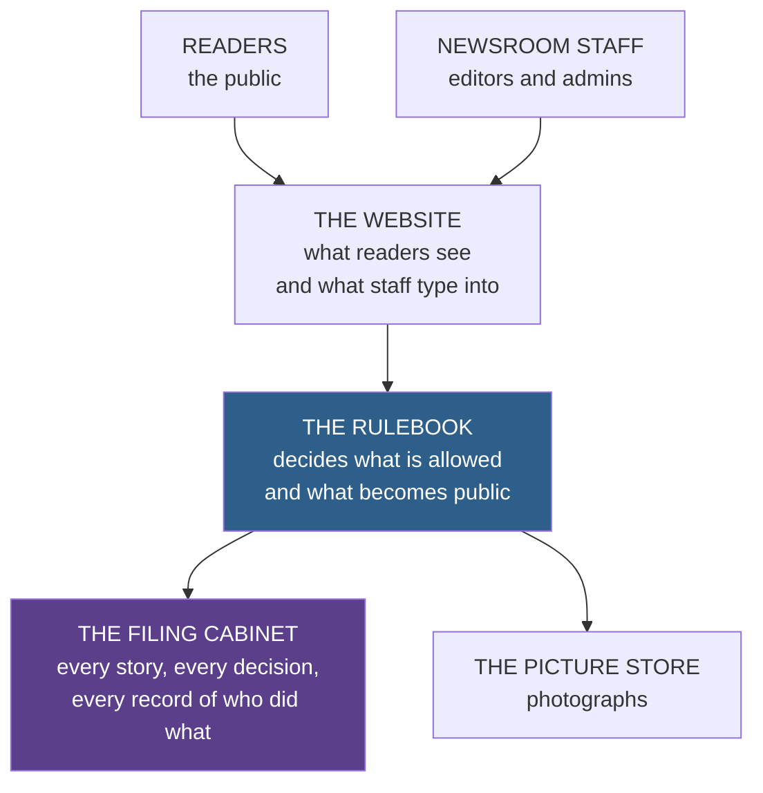
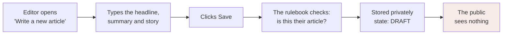
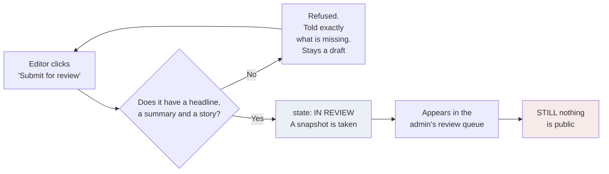
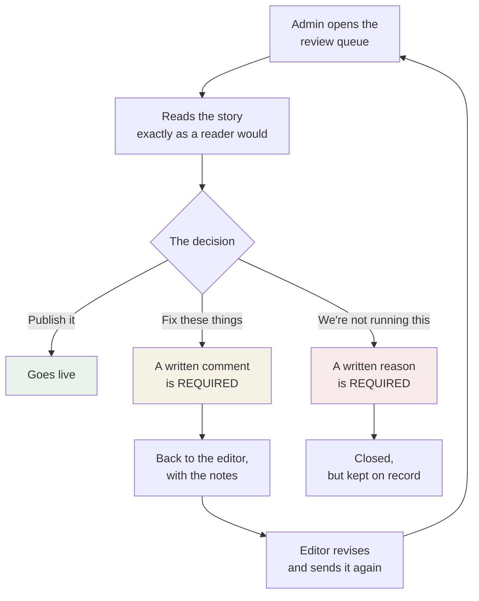
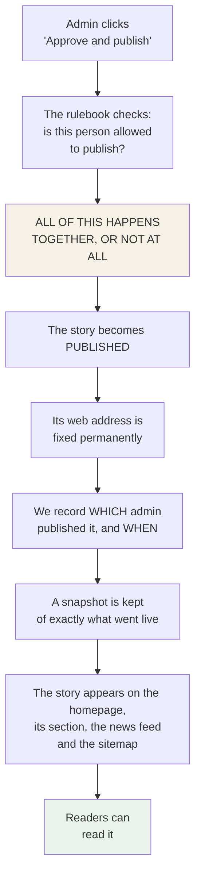
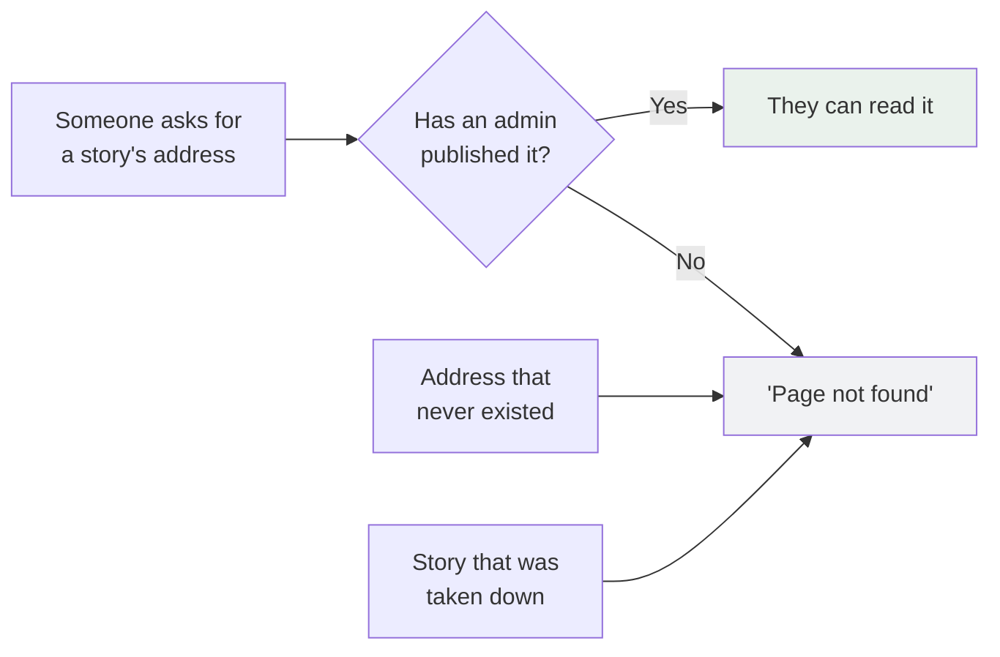
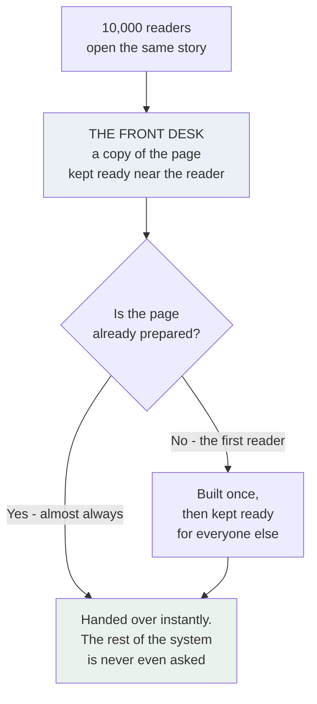
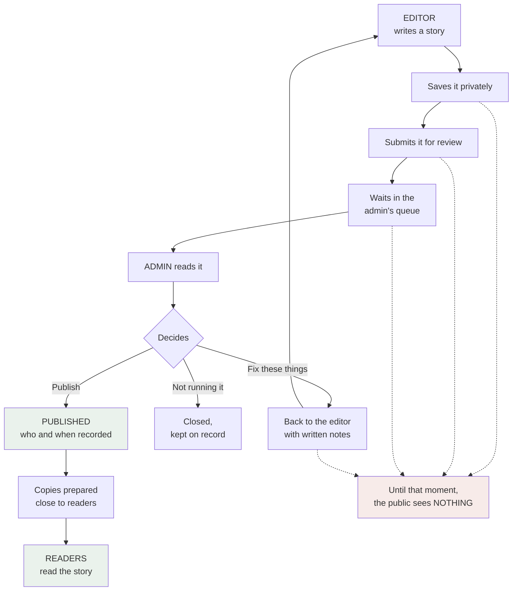

# 24 — Technical Architecture, in Plain Language

**Stage:** Phase 4A — architecture discovery
**Last updated:** 2026-09-09
**Audience:** the client. No technical background assumed.
**Companion to:** `23-architecture-discovery.md`, which is the detailed version

---

## 0. What this document is for

`23-architecture-discovery.md` explains the system to an engineer. This one
explains the same system to you, and answers the seven questions that actually
get asked in a meeting.

**The one thing to take away:**

> **The newsroom and the newspaper are two separate buildings, and the only door
> between them is one an admin has to open deliberately.**

That is not a metaphor for the sake of it. It is the actual shape of what we are
proposing to build, and it is why the design is arranged the way it is.

---

## 1. The pieces, and what each one does

Four parts. That is the whole system.

| Part | In plain terms | Why it exists |
|---|---|---|
| **The website** | The pages people look at — both the public news site and the private writing tool | It is the product |
| **The rulebook** | A separate piece of software that decides what is allowed | So there is exactly **one** place where "only admins can publish" is enforced |
| **The filing cabinet** | Where every story, draft, decision and record is kept | Stories need to be stored, and decisions need to be provable |
| **The picture store** | Where photographs are kept | Pictures are big; they do not belong in a filing cabinet designed for text |

### Why the rulebook is separate — the one design choice worth understanding

We could have built the rules into the website itself. It would have been faster.
We are recommending against it, for one reason.

If the rules live inside the website, they exist in two places — once for the
public pages and once for the newsroom pages. Two places is how a rule eventually
gets enforced in one and forgotten in the other. And the rule in question is *only
an admin can publish*.

By putting the rulebook in its own building with one door, every request — from a
reader, an editor, an admin, or from someone deliberately trying to get around the
website entirely — has to knock on the same door and be checked the same way.

> **You cannot get to the stories without going past the rules.**

---

## 2. What happens when an editor writes an article?

**In words.** The editor writes. When they click Save, the story is stored
privately as a *draft*. It is saved as often as they like. The work is also saved
automatically in the background so a closed laptop does not lose an afternoon.

**Three things that do not happen when an editor saves:**

- Nothing becomes public.
- Nobody is notified.
- No approval is requested.

Saving is just saving. **A draft is invisible to the world.** Only its author and
an admin can see it exists at all.

---

## 3. What happens when an article is submitted?

**In words.** The editor says "I'm done." The system checks the article is
actually complete, then moves it into the admin's queue and takes a snapshot of
exactly what was submitted — so an admin later can see precisely what they were
asked to approve.

**Submitting is not publishing.** It is putting something in someone's in-tray.
While it waits, the article is locked, so the text cannot change underneath the
admin who is reading it.

---

## 4. How does admin approval work?

**In words.** The admin sees everything waiting, oldest first, and how long it has
been waiting. They read the full story as a reader would see it. Then they make
one of three decisions — and only three.

**Two rules the software enforces, not the person:**

- **"Fix these things" cannot be sent empty.** The system refuses a change request
  with no explanation. Being sent back with no reason is the single most common
  source of newsroom friction, so the product prevents it rather than relying on
  good manners.
- **"We're not running this" cannot be sent empty either.** A rejection always
  carries a reason.

**And one that matters more:** an editor has no way to reach this screen. Not a
hidden button, not a disabled one. The approval controls do not exist in the
editor's half of the product, and the rulebook would refuse the request even if
someone bypassed the website entirely.

---

## 5. How does the article become public?

**In words.** One deliberate action by one authorised person makes the story
public. At that moment several things are recorded at once.

**"All of this happens together, or not at all" is worth a sentence.** The story
going live, and the record of who put it there, are written as a single
indivisible act. It is not possible for a story to be published without the record
of who published it — because if any part failed, the whole thing is undone.

That matters because "who approved this, and when?" is a question that gets asked
under pressure, sometimes by a lawyer, and the only defensible answer is a record
made at the time.

**Two more things fixed at publication:**

- **The web address never changes again**, even if the headline is later
  corrected. Addresses that have been shared and indexed are public promises.
- **Corrections do not disturb the live story.** If something needs fixing later,
  the version readers are looking at stays up, untouched, while the correction is
  written and reviewed. When an admin approves it, the corrected version replaces
  the live one instantly. Readers never see a missing or half-finished story.

---

## 6. How is unpublished content protected?

This is the question that matters most for a newsroom, so it gets the longest
answer.

**A story is visible to the public in exactly one situation: an admin has
published it.** Every other state — being written, waiting for review, sent back,
rejected, withdrawn — is invisible.

**Notice what the diagram does not have: a 'you are not allowed to see this'
answer.**

That is deliberate. If an unpublished story produced a different response from a
made-up address, then anyone could confirm a story exists before you have
published it — simply by guessing addresses. For a newsroom that is a genuine
leak, not a theoretical one. So a story that was never published, a story that was
taken down, and a completely wrong address all produce **exactly the same
response**.

**The other protections, briefly:**

| Concern | What we do |
|---|---|
| Guessing an address | Produces "not found", revealing nothing |
| An editor trying to publish directly | Refused by the rulebook, not just hidden in the website — and the attempt is recorded |
| Someone bypassing the website entirely | Meets the same checks. The website is not the security |
| Preview links | Only work for someone signed in and entitled to see that story. Not shareable |
| Link previews on WhatsApp or X | An unpublished story returns nothing to preview — a headline cannot leak that way |
| Passwords | Stored so that even we cannot read them |
| A departing journalist | Their access ends immediately, not whenever a token expires |
| The record of decisions | Cannot be edited or deleted **by anyone, including admins**. Enforced by the filing cabinet itself, not by a promise in the software |

---

## 7. What happens when thousands of readers open an article?

A story going unexpectedly big is the most likely stressful moment this system
will face. It is planned for.

**In words.** A published story is identical for every reader, so there is no
reason to rebuild it ten thousand times. The page is built once and copies are
kept ready close to readers around the world. The first person triggers the build;
everyone after that gets a copy.

**What this means in practice:** ten thousand readers do not create ten thousand
requests to the filing cabinet. They create roughly one. The traffic spike is
absorbed before it reaches the parts of the system that could struggle.

**And when you publish a correction**, the prepared copies are replaced
immediately — so readers are never left looking at a stale version.

**One deliberate consequence:** a busy newsroom cannot slow down the public site.
The staff writing and reviewing stories are working in a different part of the
system from the readers. A hectic afternoon in the newsroom is invisible to
someone reading a story on their phone.

---

## 8. What happens when something fails?

Things fail. The question is what happens next.

| If this fails | Readers see | Staff see | Why |
|---|---|---|---|
| **The rulebook is briefly down** | Published stories still load normally | Cannot sign in or submit temporarily | Prepared copies of published pages do not need the rulebook |
| **A page cannot be built** | A plain apology and a way back | — | Never a technical error message. Error text can reveal how the system is built |
| **The filing cabinet is down** | Published stories still load | Newsroom work pauses | The same protection as the first row |
| **An editor's connection drops mid-sentence** | — | Work is preserved; it saves automatically | Losing an article is the fastest way to lose a newsroom's trust |
| **A session expires while writing** | — | Sign in again and continue; unsaved text is kept | Being logged out should not cost you an afternoon |
| **Two admins decide the same story at once** | — | The second is told clearly that it already moved | Cleanly refused, never a corrupted state |
| **A publication half-succeeds** | Nothing changes | — | It is all-or-nothing. There is no half-published state |
| **A bad deployment** | Little or nothing | Brief interruption | Changes are tested on a separate copy first, and can be rolled back |
| **Data is lost or corrupted** | — | Restored from backup | Backups run automatically, and the restore is rehearsed **before** launch — an untested backup is a hope, not a backup |

**The pattern:** when something breaks, the public site keeps serving published
news. The newsroom might have to wait a few minutes. That is the right way round
for a news organisation.

---

## 9. Two records, and why they are different

The system keeps two kinds of log, and they are not the same thing.

| | **The technical log** | **The editorial record** |
|---|---|---|
| Looks like | *"A page failed to load at 14:12"* | *"Ravi Menon published 'Council approves budget' at 14:12"* |
| Who reads it | Developers, when something breaks | Admins — and potentially lawyers |
| Kept for | A few weeks | Indefinitely |
| Can it be changed? | It expires and rotates | **Never. By anyone.** |
| Is it part of the product? | No, it is plumbing | **Yes** — you can look at any story's history |

The editorial record is a feature you are buying, not a technical by-product. It
answers "who did what, and when" for every story, and it **cannot be
reconstructed later** — if it is not recorded from the first day, the first months
of publishing simply have no history.

---

## 10. What we are deliberately not building

Every part of a system has to be paid for — in money, in time, and in things that
can break. These were each considered and left out on purpose.

| Not building | Why not |
|---|---|
| A separate search system | The filing cabinet can search perfectly well at your size. A dedicated one is the most common expensive mistake in projects like this |
| A background job system | Nothing in the first version needs work to happen while nobody is watching. Scheduled publishing would be the thing that changes this |
| An extra high-speed memory layer | No measured need. It is another thing to run, secure and monitor |
| Splitting the system into many small services | One well-built system will serve this product for a long time |
| A container orchestration platform | Complexity with no matching requirement at this size |

**Each of these has a written trigger** for when it should be revisited — a
specific, measurable condition, not a hunch. That is in `23` for when it matters.

---

## 11. What is still undecided

Being straight about this: the architecture is ready, but **it rests on questions
that have not been answered yet.** Two of them affect the foundations.

| Question | Why it matters | Consequence of delay |
|---|---|---|
| **How corrections to published stories work** | Decides how stories are stored at the deepest level | The most expensive thing to change once real articles exist |
| **Can an admin approve their own article?** | **Your own documentation says both yes and no** — it needs settling | The approval process cannot be finalised until it is |
| What format the article body is in | Decides the writing tool and how safely we can publish what people type | Affects the writing experience and the security of the public site |
| What web addresses look like | They become permanent the moment a story is published | Cannot be changed afterwards without breaking every shared link |
| How big you expect to get | Everything is sized against an assumption we wrote down, not a number you gave us | If the real number is much larger, some choices change |

None of these blocks the *design*. All of them block *building*. They are listed
in full, with references, in `23-architecture-discovery.md` §27.

---

## 12. The whole thing in one picture

> **A newsroom with a door — and only admins hold the key to that door.**
>
> Everything in this architecture exists to make that sentence true even for
> someone who never opens the website at all.
